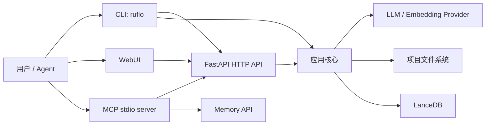
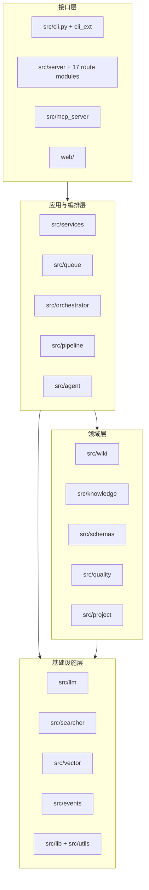
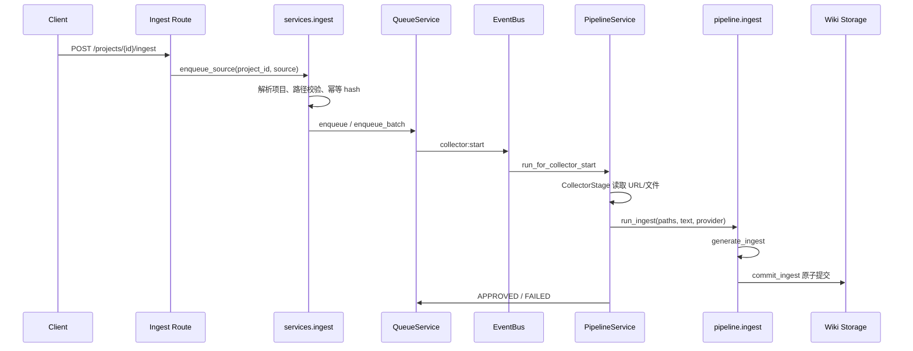
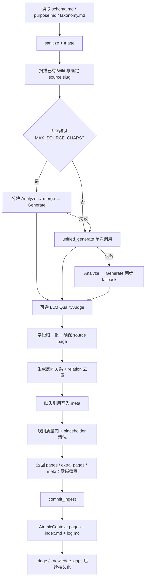
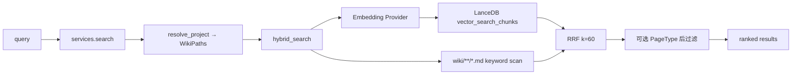
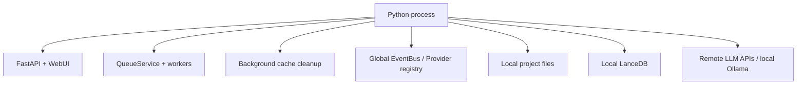

# ruflo-kb 系统架构

> 文档类型：As-Is 系统架构（当前代码事实）
> 版本：3.0
> 更新日期：2026-08-18
> 适用代码：`src/`、`web/`、`scripts/`
> 证据来源：codebase-memory 知识图谱与关键源码交叉核对

## 1. 系统定位

ruflo-kb 是一个 Python 3.11+ 多项目知识库平台。它把 URL 或文件内容转换为带 YAML Frontmatter、关系和 Wikilink 的 Markdown 页面，并提供 HTTP、CLI、MCP、WebUI、混合检索和批处理能力。

系统的首要数据原则是：

- `wiki/**/*.md` 是知识内容的事实源。
- LanceDB 是可重建的派生检索索引，不是知识事实源。
- `.llm-wiki/` 保存项目身份与持久配置。
- `.index/` 保存向量、缓存、运行状态、审查与批处理数据。

## 2. 架构快照

codebase-memory 当前索引覆盖 25,891 个节点、71,619 条关系；仅 `src/` 范围包含 2,988 个节点和 11,362 条关系。运行时代码以 Python 为主，核心入口是 `src.cli.main` 和 `src.mcp_server.main.main`。

知识图谱显示最强的运行时边界为：

| 调用方向 | 图谱调用数 | 含义 |
|---|---:|---|
| `wiki → knowledge` | 41 | Markdown 模型与 Knowledge OS 互操作 |
| `pipeline → wiki` | 38 | 摄取生成、关系对账与原子写入 |
| `server → wiki` | 36 | API 生命周期与部分查询/治理入口 |
| `pipeline → knowledge` | 25 | Candidate、对象与生命周期能力 |
| `services → wiki` | 25 | 服务层围绕项目 Wiki 执行业务操作 |
| `server → services` | 24 | HTTP 路由主要作为薄适配器 |

高扇入核心包括 `ensure_knowledge_base`、`write_page`、`read_page`、`MetadataStore.exists` 与 `EventStore.append`，说明系统的真实中心是“项目路径 + Wiki 文件 + 知识元数据”，而不是 HTTP 框架本身。

## 3. 系统上下文



CLI 并不完全经过 HTTP 或 Services：项目、治理和批处理命令中仍有直接调用领域模块的路径。MCP 的 8 个旧工具经 HTTP API 转发，5 个 Memory 工具直接使用 Knowledge OS 记忆组件。

## 4. 分层与模块职责



### 4.1 接口层

| 模块 | 责任 | 当前事实 |
|---|---|---|
| `src/cli.py`、`src/cli_ext/` | 项目、Provider、治理、批处理、服务启动 | `pyproject.toml` 注册 `ruflo = src.cli:main` |
| `src/server/` | FastAPI 应用、生命周期、指标、静态站点 | 17 个路由模块，源码中 52 个 FastAPI 路由声明 |
| `web/` | 浏览器端管理界面 | 服务启动时挂载到 `/` |
| `src/mcp_server/` | stdio MCP | 13 个工具：8 legacy HTTP + 5 Memory |

### 4.2 应用与编排层

| 模块 | 责任 |
|---|---|
| `src/services/` | HTTP 与领域之间的业务服务；项目解析、摄取、搜索、聊天、Schema、审查、质量等 |
| `src/queue/` | JSON 持久队列、状态机、重试、死信、暂停/恢复、in-flight 跟踪 |
| `src/pipeline/` | 采集、清洗、LLM 生成、关系对账、质量门与提交 |
| `src/orchestrator/` | BatchRunner、批状态机、批级门禁与回滚编排 |
| `src/agent/` | Researcher、Librarian 等 Agent 与工具适配 |

### 4.3 领域层

| 模块 | 责任 |
|---|---|
| `src/wiki/` | WikiPage、路径、模板、读写、索引、关系、标签、热度、lint、知识缺口 |
| `src/knowledge/` | KnowledgeObject、Candidate、生命周期、版本、Claim、冲突、记忆、溯源、事件存储 |
| `src/project/` | 多项目注册、发现、ProjectContext 与项目级配置 |
| `src/schemas/` | Schema 迁移与注册 |
| `src/quality/` | LLM Judge、隔离与质量设置 |

### 4.4 基础设施层

| 模块 | 责任 |
|---|---|
| `src/llm/` | OpenAI、Anthropic、Ollama、OpenAI-compatible Provider；共享 embedding runtime |
| `src/vector/` | 项目级 LanceDB handle、chunk 向量、维度约束、查询与删除 |
| `src/searcher/` | 语义检索、关键词检索与 RRF 融合 |
| `src/events/` | 模块级 EventBus 与事件载荷 |
| `src/lib/` | 原子上下文、写钩子、项目解析等有副作用基础能力 |
| `src/utils/` | 路径、文本、幂等、slug 等通用函数 |

## 5. 当前摄取主链路

### 5.1 异步 HTTP 摄取



`QueueService` 使用 `.kb-queue.json` 持久化任务，状态变更受状态机约束；失败可重试，超过阈值进入 dead letter。服务重启时，FastAPI lifespan 会恢复未完成任务，默认最多启动 6 个并发 worker。

文件夹输入当前已经接通：`enqueue_source({"folder": ...})` 调用 `collect_files`，按支持扩展名过滤、逐文件生成幂等 hash、批量入队，并写入批状态。

### 5.2 `generate_ingest` 的真实执行顺序



关键边界：

- `generate_ingest` 负责生成与内存对账，声明为零磁盘写阶段。
- `commit_ingest` 用 `AtomicContext`、`safe_write` 和 flush callback 批量提交 Wiki 页面、目录索引和审计日志。
- 反向关系影响的既有页面通过 `extra_pages` 与新页面一并提交。
- 未解析引用进入 `.index/knowledge_gaps.json`，不再自动制造 stub 页面。

### 5.3 Candidate / Knowledge OS 的当前接入状态

代码库已经包含：

- JSON Analyzer → `KnowledgeCandidate`
- `ReviewerStage`
- `CandidatePromoter`
- `generate_from_candidate`
- `generate_from_knowledge_object`
- `KnowledgeObject` 生命周期、版本、Claim、冲突、记忆与溯源

但当前 `generate_ingest` 主链没有调用 Reviewer、Promoter 或 `generate_from_knowledge_object`。默认短文路径仍是 `unified_generate`，失败才回退到 Analyze → Generate；长文路径优先分块 Analyze → Generate。因此 Knowledge OS 是“可用领域能力”，不是当前 HTTP 摄取的主数据通路。

`PipelineService` 虽注册 `CollectorStage / AnalyzerStage / GeneratorStage`，实际只执行 `self._stages[:1]` 的 Collector，后续统一委托 `run_ingest`。这项事实是理解系统的关键，不能从 stage 列表推断实际运行顺序。

## 6. 搜索与对话链路



搜索具有明确降级策略：

- embedding 或向量库不可用时退化为关键词检索；
- 关键词无结果时仍可返回语义结果；
- 两侧都有结果时用 Reciprocal Rank Fusion 合并；
- `_archive`、`_stubs`、`index.md`、`log.md` 不参与关键词结果；
- 请求通过 `WikiPaths` 约束到目标项目，向量表也按项目根路径缓存。

Chat、Agent tools 和 MCP legacy search 最终复用这条搜索能力或对应服务。

## 7. 数据模型

### 7.1 WikiPage：持久化事实模型

`WikiPage` 是磁盘 Markdown 的直接模型。当前内置 `PageType` 有 8 种：

| PageType | 默认目录 |
|---|---|
| `source` | `wiki/sources/` |
| `entity` | `wiki/entities/` |
| `concept` | `wiki/concepts/` |
| `synthesis` | `wiki/synthesis/` |
| `claim` | `wiki/claims/` |
| `decision` | `wiki/decisions/` |
| `procedure` | `wiki/concepts/` |
| `event` | `wiki/concepts/` |

核心 Frontmatter 字段包括：`id`、`title`、`type`、`sources`、时间戳、`relations`、`grade`、`processing_depth`、`is_immutable`、热度字段、`tags`、`category`、`taxonomy_sub`、`related_entities` 和 `custom_type`。正文保存在 Frontmatter 之后。

自定义类型由项目 `schema.md` 声明；`custom_type` 保留自定义名，`type` 保留其基础 PageType 以复用模板与行为。

### 7.2 KnowledgeObject：知识运行模型

`KnowledgeObject` 增加 `lifecycle`、`confidence`、`provenance` 与 `versions`。生命周期包含 `created / processing / reviewing / active / deprecated / archived / failed / rejected`。

Wiki 与 Knowledge OS 之间通过 adapter、storage facade 和事件桥接协作，但磁盘事实仍以 WikiPage 为准。

## 8. 项目与存储布局

```text
<project>/
├── schema.md / purpose.md / taxonomy.md
├── raw/sources/                  # 原始输入
├── wiki/                         # 事实源
│   ├── sources/ entities/ concepts/ synthesis/
│   ├── claims/ decisions/ _stubs/ _archive/ media/
│   ├── <custom-type>/
│   ├── index.md                  # 页面目录
│   └── log.md                    # 审计日志
├── .llm-wiki/                    # 项目身份与持久配置
│   ├── project.json
│   ├── slug_aliases.json
│   └── .backup/
├── .index/                       # 派生与运行数据
│   ├── lancedb/
│   ├── lint_cache/
│   ├── staging/ quarantine/ dedup_history/
│   ├── knowledge_gaps.json
│   ├── reviews*.json
│   └── batch_build_state.json
├── .kb-queue.json                # 队列持久化（进程 CWD 语义）
└── .kb-queue-paused              # 暂停标记
```

### 8.1 原子性

新增/更新页面通过 `AtomicContext` 缓冲 `safe_write`。需要删除文件的复合操作必须使用 `DELETE_SENTINEL`，避免“写入可回滚、删除不可回滚”的半提交状态。

### 8.2 LanceDB

每个项目拥有独立的 `.index/lancedb/chunks` 表。handle 以规范化项目根路径缓存。向量维度由 Provider 决定：本地模型常用 384，远端 Provider 常见 1536。

已有表与新 Provider 维度不匹配时抛出 `VectorDimensionMismatchError`，不会静默删除数据；只有显式 `rebuild_vector_schema` 可以重建表。

## 9. 运行时生命周期

FastAPI `lifespan` 在启动时执行：

1. 注册摄取状态 tracker；
2. 自动发现项目；
3. 初始化远端 embedding provider，失败时尝试本地 sentence-transformers；
4. 初始化当前 CWD 项目的 LanceDB、DecayBridge 和 KnowledgeKernel；
5. 对已配置 LLM Provider 做超时健康检查；
6. 恢复未暂停的持久队列；
7. 启动每小时缓存清理任务。

关闭时取消清理任务，并通过 `ProviderRegistry.aclose_all()` 释放 Provider 客户端。

注意：启动期向量初始化仍以进程 CWD 作为“活动项目”，而请求期搜索会按 `project_id` 延迟初始化目标项目向量表。部署时必须从预期根目录启动，或依赖每请求的显式项目解析。

## 10. MCP 架构

MCP Server 使用 stdio 传输，公开 13 个工具：

- 8 个 deprecated legacy 工具：状态、项目、选项目、文件、读文件、搜索、摄取、审查；经 `RufloKbAPIClient` 调用 HTTP API。
- 5 个 Memory 工具：`memory_search / recall / explain / verify / update`；直接使用记忆检索、决策记录和溯源组件。

Memory update 只允许修改 `title`、`content`、`grade`，这是 MCP 写边界的重要安全约束。

## 11. 横切能力

| 能力 | 实现 |
|---|---|
| 权限 | `AgentType × Permission` allow-list；Orchestrator 放行 |
| 幂等 | source/type/context/project 生成 hash；活动任务去重 |
| 重试与死信 | Queue RetryPolicy，默认最大重试 3 次 |
| 断路器 | 全局 circuit breaker，队列失败参与状态转换 |
| 质量 | sanitizer、triage、规则 gate、可选 LLM judge、lint、批级 gate |
| 关系一致性 | 反向边补全、目标去重、非法 relation 过滤、gap ledger |
| Schema | 项目 schema registry + 迁移框架 + 写前验证 |
| 生命周期 | Heat/DecayBridge 与 KnowledgeObject 生命周期 |
| 可观测性 | `wiki/log.md`、队列状态、metrics route、批报告、Provider health |

## 12. 部署拓扑

当前设计是单进程优先：



多个 FastAPI 进程会各自持有 EventBus、Provider、in-flight tracker 与内存缓存；当前文件队列和部分进程级 singleton 并未形成分布式协调。因此生产部署应默认单 worker，除非先外置队列、锁和进程全局状态。

## 13. 已知架构风险

| 风险 | 现状 | 建议触发条件 |
|---|---|---|
| 文档/注释与摄取主链漂移 | 部分说明仍称 Candidate 是默认路径，源码实际默认 unified | 改流水线时以可执行调用链测试为准，并同步本文 |
| Knowledge OS 未成为主摄取链 | Reviewer/Promoter/KO Generator 存在但未被 `generate_ingest` 调用 | 只有明确要求证据审查成为强制门时再接线 |
| `generate_ingest` 体积和复杂度高 | 知识图谱记录 559 行、cyclomatic 47、cognitive 103 | 出现独立变更频率或回归热点时按阶段拆分，不预先抽象 |
| 单进程全局状态 | EventBus、Provider registry、部分 active project 状态为进程级 | 需要多 worker/横向扩展时外置 |
| CWD 敏感 | 服务启动、队列文件和部分兼容路径依赖 CWD | 容器化或多项目托管前统一显式 data root |
| CLI 边界不统一 | 部分 CLI 直接进入领域模块，未全部走 Services | 需要统一授权/审计时收敛入口 |
| 向量派生不保证随写同步 | 部分 CLI/批路径无 embedding provider 时会降级 | 语义搜索成为硬 SLA 时增加可观测的重建/补偿任务 |

## 14. 架构约束

后续修改必须保持以下约束：

1. Wiki Markdown 是事实源，索引可重建。
2. 路由保持薄适配器，业务逻辑优先进入 Services 或领域模块。
3. 项目操作使用 `resolve_project()` 返回的 `(ProjectContext, WikiPaths)`；禁止假设 `ctx.paths` 存在。
4. 跨项目请求必须显式传递 `WikiPaths`，不能依赖最近初始化项目。
5. WikiPage 字段变更必须同步 `to_frontmatter_dict()` 与 `from_dict()`。
6. 多文件变更使用原子写；删除通过 `DELETE_SENTINEL` 参与事务。
7. Provider 变更不得静默重建不同维度的向量表。
8. 修改 `web/js/views/*.js` 的按钮、事件或 API 时同步 `docs/webui-buttons.md`。
9. 修改摄取主链时同时验证：队列事件注册、服务实际启动、HTTP `/health`、目标流水线测试。

## 15. 证据入口

| 主题 | 代码入口 |
|---|---|
| HTTP 应用 | `src/server/app.py` |
| HTTP 路由 | `src/server/routes/` |
| CLI | `src/cli.py`、`src/cli_ext/` |
| MCP | `src/mcp_server/main.py`、`memory_tools.py` |
| 队列 | `src/queue/service.py` |
| 流水线编排 | `src/pipeline/service.py` |
| 摄取实现 | `src/pipeline/ingest.py` |
| Wiki 模型 | `src/wiki/core/types.py` |
| Wiki 路径 | `src/wiki/core/paths.py` |
| Knowledge OS | `src/knowledge/` |
| 搜索 | `src/services/search.py`、`src/searcher/hybrid_search.py` |
| 向量存储 | `src/vector/store.py` |
| Provider | `src/llm/` |
| 批处理 | `src/orchestrator/batch_runner.py` |

本文描述当前可执行代码，而非规划中的目标架构。目标演进应写入 `docs/superpowers/plans/` 或 `docs/adr/`，完成后再同步本文。
