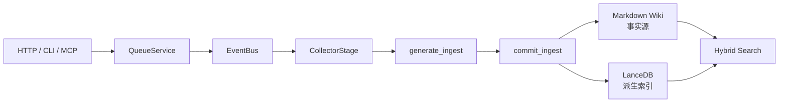

# ruflo-kb 系统架构审计

> 审计日期：2026-08-18
>
> 代码基线：`99595e94`（同时核验当前工作区源码）
>
> 审计对象：当前 As-Is 架构，而非规划中的目标架构
>
> 参考架构说明：[`docs/ARCHITECTURE.md`](ARCHITECTURE.md)

## 1. 审计结论

ruflo-kb 已形成可工作的本地知识库主链路：以 Markdown Wiki 为事实源，通过 HTTP、CLI、MCP 和 WebUI 接入，使用持久化任务队列驱动采集、LLM 生成、写盘和向量检索。`WikiPaths`、`WikiPage`、`QueueService` 和 LLM Provider Adapter 是当前最稳定、最有深度的 Module；项目级路径校验、任务重试、死信、熔断、幂等检查、单文件原子替换、混合检索降级和 Schema 备份构成了有效的基础控制。

但系统目前只适合**受信任用户、回环地址、单进程、单 worker、本机文件系统**的部署形态。这个运行前提没有被完整地编码为硬约束。只要服务绑定到非回环地址，未鉴权的管理 Interface 就会暴露完整 API Key 和删除、摄取、队列控制能力，构成条件性 Critical 风险。

综合成熟度为 **17/40（42.5/100，存在关键上线阻断项）**。主要问题不是“模块太少”，而是若干 Interface 的承诺与实际语义不一致：

1. HTTP 管理面无认证，Provider 详情和新增响应返回明文 API Key。
2. `AtomicContext` 名称暗示事务，但多文件提交失败会被吞掉并继续，可能留下部分提交。
3. 低质量文档快速拒绝分支使用不存在的异步上下文协议，并以错误签名调用三个写入函数，启用后必然失败。
4. `/health` 永远返回健康，无法反映队列、向量库、磁盘和 LLM Provider 故障。
5. Queue、EventBus、锁、指标和部分 Provider 状态都是进程内状态，但启动参数未阻止多 worker 或外部暴露。
6. Reviewer → Promoter → KnowledgeObject 架构已经实现，却不在默认摄取主链路上；当前形成两套模型并存的演化成本。

## 2. 评分方法

| 分值 | 含义 |
|---:|---|
| 0 | 缺失，或现状与声明相反 |
| 1 | 主要依靠隐含假设或人工操作 |
| 2 | 有部分机制，但覆盖或语义不完整 |
| 3 | 主路径机制完整，边界情况仍需补强 |
| 4 | 约束明确、机制完整，并有可验证证据 |

| 审查维度 | 得分 | 判定 |
|---|---:|---|
| 1. 目标与硬性约束 | 1/4 | 产品目标清楚，运行边界和 NFR 未闭合 |
| 2. 领域边界与模块划分 | 2/4 | 核心 Module 可辨认，但存在绕过和双轨模型 |
| 3. 依赖拓扑 | 3/4 | 主要依赖及部分降级明确，可复现性不足 |
| 4. 数据流与状态管理 | 2/4 | 主链路清楚，事务与多进程语义不足 |
| 5. 异常与故障模型 | 2/4 | 有重试、死信、熔断，故障传播和探针不完整 |
| 7. 扩展性与演化成本 | 2/4 | 有真实 Seam，也有未接入的预留架构 |
| 8. 可观测体系 | 1/4 | 有日志和基础指标，没有可靠健康、追踪和告警 |
| 9. 部署、运维与回滚 | 2/4 | 本地启停和局部回滚可用，缺少发布级回滚 |
| 10. 安全与权限隔离 | 1/4 | 文件边界有防护，HTTP 管理面未形成信任边界 |
| 11. 盲区与隐性假设 | 1/4 | 关键假设多，且部分文档与代码漂移 |

## 3. 最高优先级发现

### A-01 条件性 Critical：HTTP 管理面可泄露密钥并执行破坏性操作

**证据**

- CLI 默认绑定 `127.0.0.1`，但 `--host` 接受任意地址：`src/cli.py:339`。
- FastAPI 未安装认证、TrustedHost、限流等中间件：`src/server/app.py`。
- `GET /api/v1/providers/{name}` 和 `POST /api/v1/providers` 使用 `redact_keys=False`，返回完整 API Key：`src/server/routes/providers.py:67`、`src/server/routes/providers.py:103`。
- 项目、文件、摄取、队列和 Provider 删除 Interface 均未见身份认证。
- `src/permissions.py` 的 Agent 权限模型只在 Collector 等内部路径使用，没有保护 HTTP 管理面。

**影响**

默认回环部署时风险受主机账户边界限制；一旦绑定 `0.0.0.0`、进入容器共享网络、被反向代理暴露或发生浏览器侧请求伪造，攻击者可读取 LLM 凭据、修改 Provider、提交任意任务和调用破坏性操作。

**最低成本整改**

1. 所有 Provider 响应强制脱敏，不提供“为编辑返回原密钥”的例外。
2. 未配置认证令牌时拒绝绑定非回环地址。
3. 对所有 `/api/v1` 写操作和密钥管理操作增加一个统一 Bearer Token 检查；无需引入账号系统或 OAuth。
4. 保留 `/health` 的匿名访问，但不得泄露配置。

### A-02 High：`AtomicContext` 不是多文件事务

**证据**

- `safe_write` 对单文件采用临时文件加 `os.replace`，这是有效的防撕裂写入：`src/lib/write_hooks.py:69`。
- Windows 下连续失败后退化为 `unlink + rename`，存在目标暂时缺失的窗口：`src/lib/write_hooks.py:48-66`。
- `AtomicContext.__exit__` 逐个写入捕获的路径；单个路径失败只记录日志，继续写其他路径；flush callback 失败也明确吞掉：`src/lib/atomic_ctx.py:91-108`。

**影响**

页面、`index.md`、`log.md` 和删除操作可能只完成一部分。调用方无法从异常获知提交失败，后续任务会把不一致状态当成成功状态继续处理。

**最低成本整改**

- 短期：把 Interface 和文档改称“批量延迟写入”，提交失败向调用方抛出，并在失败时将任务标记为失败；不要宣称全局原子性。
- 若确实要求全成或全败：先写入同文件系统的 staging 目录，全部成功后再交换清单；不要为此引入数据库。

### A-03 High：低质量文档拒绝分支是确定性故障

**证据**

- `_write_rejected_source_page` 使用 `async with AtomicContext()`：`src/pipeline/ingest.py:310`。
- `AtomicContext` 仅实现 `__enter__` / `__exit__`，未实现异步协议：`src/lib/atomic_ctx.py:33`。
- 该分支还以额外的 `ctx` 参数调用 `write_page`、`append_to_index`、`log_event`，与当前函数签名不匹配：`src/wiki/storage/page_writer.py:78`、`src/wiki/features/indexer.py:16`、`src/wiki/features/logger.py:14`。
- 分支在 `RUFLO_SANITIZER_SKIP_LLM=1` 且预过滤判定跳过 LLM 时进入：`src/pipeline/ingest.py:428-430`。

**影响**

一旦启用该配置，目标本应是“跳过昂贵 LLM 调用并保留 C 级来源页”，实际结果却是任务异常，且不会生成预期审计页。

**最低成本整改**

使用现有同步 `with AtomicContext(flush_pending_writes)` 模式，并按三个函数的真实签名调用；补一个覆盖该环境变量分支的测试即可。

### A-04 High：健康检查持续假绿

**证据**

- `/health` 无条件返回 `ok: true`：`src/server/routes/health.py:5-13`。
- 启动时 Provider、sentence-transformers、向量库和队列恢复失败大多只记录 warning 后继续：`src/server/app.py`。
- 本地 embedding fallback 依赖 `sentence-transformers`，但该包不在 `pyproject.toml` 依赖中：`src/llm/local_embed.py:48-52`。

**影响**

服务进程存活会被误判为摄取和检索可用。运维人员无法从探针判断是 LLM、向量库、队列还是磁盘故障。

**最低成本整改**

保留 `/health` 作为 liveness；增加 `/ready`，只检查当前主路径需要的队列持久化目录、Wiki 可写性、向量库初始化状态和默认 Provider 状态，并逐项返回结果。

### A-05 High：进程内状态与部署参数之间没有护栏

**证据**

- Queue 使用进程内 `threading.Lock` 和单个 JSON 快照文件：`src/queue/persistence.py:24-36`。
- EventBus、in-flight tracker、Pipeline semaphore、MetricsRegistry 和部分 Provider 均为进程内单例。
- Queue 文件写入没有跨进程锁；多进程各自加载、修改并覆盖快照。

**影响**

两个服务进程或多 worker 会产生丢任务、重复执行、状态覆盖和指标分裂。文件级 `os.replace` 只能避免撕裂，不能提供跨进程读改写互斥。

**最低成本整改**

把“只允许单进程单 worker”编码为启动检查和部署文档，检测同项目 PID/锁文件后拒绝第二实例。只有出现明确的多实例吞吐需求时，才迁移到外部队列和共享状态存储。

## 4. 按基线逐项审计

### 4.1 目标与硬性约束

**已有基础**

- 核心目标明确：多格式内容摄取、结构化 Markdown Wiki、向量归档和混合检索。
- `docs/CONSTRAINTS.md` 明确 Python、Markdown、LanceDB 和单机轻量化方向。
- 摄取并发通过 semaphore 限制，队列有重试上限，向量维度不匹配时拒绝破坏性迁移。

**缺口**

- 未定义可验证的延迟、吞吐、最大文件、最大项目、磁盘增长、LLM 成本、恢复时间和数据丢失目标。
- “硬性约束”和“偏好”混在一起。例如不使用容器或外部数据库更像当前部署选择，不应被写成永久技术红线。
- 未明确受支持的部署矩阵：Windows/Linux、单用户/多用户、回环/局域网、多进程是否允许。
- 合规边界缺失：外部 LLM 发送哪些内容、保存哪些凭据、数据保留和删除责任均未声明。

**判定**：目标清楚，但约束无法作为验收门。至少应补一页“支持范围与非目标”，不需要先建设容量平台。

### 4.2 领域边界与 Module 划分

**有效设计**

- `WikiPage` + `WikiPaths` 把页面模型和项目布局集中在稳定 Interface 后，Depth 和 Leverage 较好。
- `QueueService` 用较小 Interface 封装持久化、状态推进、重试和事件发射，是较深的 Module。
- Provider Protocol + OpenAI、Anthropic、Ollama、OpenAI-compatible Adapter 是真实的替换 Seam。
- HTTP routes → Services → Domain 的目标方向合理。

**问题**

- 代码图显示 `server → wiki` 直接调用 36 处，而 `server → services` 为 24 处；Heat、Quality、Templates 和生命周期初始化绕过 Services，Locality 被削弱。
- `wiki → knowledge` 41 处，同时 `knowledge → wiki` 8 处，两个领域包存在双向依赖，生命周期与页面模型的职责边界不稳定。
- `PipelineService` 声明 Stage Interface，却只执行 `_stages[:1]` 的 CollectorStage，再跳到 `run_ingest`：`src/pipeline/service.py:109`。这是一个表面可插拔、实际被绕过的浅 Interface。
- 默认主链路仍是 `generate_ingest` / `commit_ingest`；Reviewer、Promoter、KnowledgeObject Generator 已实现但未接入。当前不是一种模型的渐进扩展，而是两套模型同时承担认知成本。
- 复杂度热点集中在 `generate_ingest`、`parse_llm_json` 和 `lint_wiki`，说明流程分支的 Locality 不足，而不是简单的“文件太大”。

**建议**

只做两项收敛：让 routes 通过现有 Services；对候选知识链路作出“接入主链路或删除”的明确决定。不要再新增第三套 Pipeline 抽象。

### 4.3 依赖拓扑

**强依赖**

- Python 3.11+、本地文件系统、FastAPI/Uvicorn、Pydantic、LanceDB/PyArrow。
- 文档解析器：pypdf、python-docx、openpyxl、PyYAML。
- LLM/Embedding Provider 及其网络端点。

**弱依赖与降级**

- 远程 embedding 失败后尝试本地 sentence-transformers；再失败时部分检索路径可退化到关键词。
- 语义检索异常可降级为关键词检索。
- LLM 任务失败进入重试、死信和熔断。
- 缓存、热度、指标等辅助状态失败通常不应破坏 Wiki 事实源。

**缺口**

- `pyproject.toml` 只有依赖下限，无锁文件或上限，部署不可重复。
- 声明的本地 embedding fallback 未作为依赖安装，属于“代码存在但默认环境不可用”的降级。
- 测试通过大量 conftest stub 隔离重依赖；这有利于单元测试，却不能证明 FastAPI lifespan、LanceDB、解析器和真实 Provider 的集成可用。
- 故障分类没有形成统一表：哪些依赖允许 fail-open、哪些必须 fail-closed，主要散落在异常捕获中。

### 4.4 数据流与状态管理

主数据流为：

**状态位置**

| 状态 | 位置 | 性质 |
|---|---|---|
| Wiki 页面、index、log | 项目 `wiki/` | 事实源 |
| 向量 | `.index/lancedb/` | 可重建派生状态 |
| Queue | `.kb-queue.json` | 单进程持久状态 |
| Project 注册表、Provider 配置 | 用户配置目录 | 全局配置状态 |
| EventBus、锁、in-flight、指标 | 进程内 | 重启丢失或重建 |
| reviews、cache、staging、quarantine | `.index/` | 运营与中间状态 |

**主要风险**

- 异步任务与文件系统写入之间没有端到端事务；Queue 成功状态必须以后置写入结果为准。
- 幂等主要依赖进程内 TTL、任务 hash 和页面 slug；多进程和重启边界下保证不等价。
- JSON Queue 对单进程足够，但腐坏时会记录 warning 并以空队列启动，可能静默丢失待处理任务。
- 上传路由先 `await file.read()` 将全文件读入内存，服务层没有大小上限：`src/server/routes/files.py:57`、`src/services/files.py:303`。外部暴露时可造成内存耗尽。
- 向量是派生状态这一原则正确，但页面写入成功、向量 upsert 失败后的自动补偿路径不够明确。

### 4.5 异常与故障模型

**已有控制**

- Queue 最多重试 3 次并进入 dead-letter：`src/queue/retry.py:13`。
- CircuitBreaker 具备 CLOSED / OPEN / HALF_OPEN 状态和恢复计时。
- EventBus 默认隔离 handler 异常，避免一个订阅者阻止其余订阅者。
- Quality、检索和 embedding 的部分故障有降级路径。

**缺口**

- `CircuitBreakerConfig.failure_threshold` 当前为 10，而项目说明仍写 3，运行手册与代码漂移。
- 广泛的 `except Exception` 把配置错误、依赖故障、数据错误和程序缺陷压成 warning，故障传播规则不清。
- `AtomicContext` 吞提交失败会把“数据未完整写入”转换成“调用成功”。
- `/health` 无法作为故障隔离入口。
- 没有全局限流和任务资源预算；6 个摄取任务可能同时触发 LLM、解析和 embedding，Provider 级配额未统一管理。
- EventBus `create_task` 类型的后台执行缺少统一 task registry 和完成回调，意外异常可能只由事件循环报告。

### 4.6 扩展性与演化成本

**合理预留**

- Provider Adapter、Wiki schema migration、custom type、可重建向量层都对应已经存在的变化轴。
- ProjectContext/WikiPaths 把多项目路径差异集中起来，新增项目不会复制整套逻辑。

**过度或失效预留**

- 候选知识域、Reviewer、Promoter、KnowledgeObject Generator 与默认摄取双轨并存，尚未产生主链路 Leverage。
- Stage Interface 只执行一个 Stage，其余流程走旧入口；继续增加 Stage 会扩大误导。
- 许多 server route 直接依赖 Wiki 内部文件，未来替换存储或调整 Wiki 结构时改动面扩大。

**演化原则**

- 不拆微服务；当前文件系统事实源与单机产品目标匹配。
- 不因“未来多实例”提前引入 Redis、Kafka 或 PostgreSQL。先把单进程限制写死；真实需求出现后再替换 Queue Backend。
- 不为每个函数增加 Interface。只保留 Provider、Queue Backend、Object Store 这类已有两个以上实现或明确测试替身的 Seam。

### 4.7 可观测体系

**现状**

- 有 Python 日志、Wiki 操作日志、Queue 状态和 Prometheus 文本 `/metrics`。
- 指标覆盖 ingest、chat、LLM duration/cost、active tasks、candidate verdict。
- 部分日志包含 task/project 标识。

**缺口**

- 无可靠 readiness；liveness 与业务可用性混为一谈。
- 指标注册表为进程内单例，多进程时不聚合。
- metrics router 缓存第一次选择的数据库路径，多项目语义不完整；每次 scrape 同步写 SQLite，监控读取具有副作用。
- 无统一 correlation ID，没有从 HTTP 请求 → Queue task → Pipeline → Provider → Writer 的链路关联。
- 未发现告警规则和阈值；即使指标存在，也没有“何时需要处理”的运行契约。
- 日志级别不能稳定区分可降级事件、任务失败和系统故障。

**最低可用目标**

无需先引入 OpenTelemetry。先统一 `request_id` / `task_id` / `project_id` 三个日志字段，补 `/ready`，并为 dead-letter、队列积压、连续 Provider 失败和磁盘写失败定义四条告警条件。

### 4.8 部署、运维与回滚

**已有能力**

- `start.bat`、CLI foreground/daemon、PID 和日志文件支持本机启停。
- Schema migration 有 backup/restore。
- Batch build 和严格范围清理具备局部快照/回滚；向量可显式重建。
- Queue 可在进程重启后恢复 PENDING 任务。

**缺口**

- 无正式发布产物、依赖锁、CI 集成验证或版本升级/降级手册。
- 无灰度和通用应用回滚；当前更接近“源码目录直接运行”。
- `start.bat` 会强制杀死占用 19828 端口的任意进程，可能误杀无关服务。
- 包版本为 `2.0.0`，FastAPI 和 `/health` 报告 `0.2.0`，版本不可作为诊断依据。
- 向量重建是人工步骤；Wiki、Queue、全局 Provider 配置和 `.index` 的备份边界没有统一说明。

**最低成本整改**

固定依赖、统一版本源、提供“备份 Wiki + Queue + 项目元数据、升级、smoke、失败恢复”的单页 runbook。单机项目不需要灰度平台；可用并行目录加端口切换完成最小灰度。

### 4.9 安全与权限隔离

**已有控制**

- 项目文件读取使用路径归一化和 project-root 限制。
- 上传文件名取 basename，并限制扩展名。
- Collector 对 URL 具备 DNS/重定向相关防护，降低 SSRF 风险。
- Provider 配置尝试通过文件权限保护，API 列表默认脱敏。
- AgentType × Permission 存在内部权限模型。

**缺口**

- HTTP 没有认证、授权和限流，内部 Agent 权限不能替代用户身份权限。
- 单 Provider 读取和新增响应泄露完整密钥。
- Provider 密钥以明文 JSON 保存；Windows 下 `chmod(0600)` 不能等价提供 POSIX 权限保证。
- 上传无大小限制且一次性读入内存。
- 缺少明确的外部 LLM 数据出境提示、日志脱敏规则和凭据轮换流程。
- 多项目是路径隔离，不是租户隔离；同一服务进程中的调用者可访问所有注册项目。

### 4.10 盲区与隐性假设

当前架构依赖以下未充分声明或未被代码强制的假设：

| 隐性假设 | 失效后风险 |
|---|---|
| 仅受信任用户访问 localhost | 密钥泄露、配置篡改、删除与资源滥用 |
| 始终单进程单 worker | Queue 覆盖、重复任务、指标和锁失效 |
| 本地文件系统支持可靠 rename | 原子写退化，出现目标缺失或部分提交 |
| CWD 就是当前项目 | 向量库、Queue、缓存或 Wiki 指向错误目录 |
| LLM 输出可被现有解析与修复逻辑接收 | 生成空页、stub 或高比例人工复核 |
| Markdown index/log 可由单进程串行更新 | 并发覆盖和索引漂移 |
| 重依赖 stub 测试能代表真实运行 | server lifespan 和原生依赖回归漏检 |
| Wiki 写入成功后向量最终可重建 | 搜索长期缺页且没有自动发现 |
| Provider API 和模型兼容性稳定 | 摄取失败或静默降级 |

此外，文档已有多处漂移：熔断阈值 3/10、包版本 2.0.0/API 版本 0.2.0、候选 Pipeline 的“默认路径”与实际主链路不一致。架构文档必须以可执行检查或测试绑定关键声明。

## 5. 整改路线图

### P0：外部暴露前必须完成

1. Provider 响应永不返回原始 API Key。
2. 无认证时拒绝非回环绑定；给 `/api/v1` 管理和写操作增加单一 Bearer Token。
3. 上传改为有上限的流式写入；超限返回 413。

### P1：下一稳定版本完成

1. 修复低质量文档拒绝分支并补回归测试。
2. 明确 `AtomicContext` 的非事务语义，提交错误必须传播并让任务失败。
3. 增加 `/ready` 分项检查；统一服务版本来源。
4. 启动时强制单实例/单 worker，补项目根目录显式配置，减少 CWD 推断。
5. 为 Wiki 已写、向量未写的情况增加可扫描的补偿任务或健康检查。

### P2：主链路稳定后完成

1. 写明支持范围、NFR、备份和回滚 runbook，并固定依赖版本。
2. 让 HTTP routes 逐步通过已有 Services；只在改动相关 route 时顺手收敛，避免大重构。
3. 对候选知识链路作一次保留/接入/删除决策，停止双轨扩张。
4. 增加结构化日志关联字段和四条基础告警；暂不引入新观测平台。

## 6. 审计通过标准

满足以下条件后，可把架构状态从“存在关键上线阻断项”提升为“适合受控单机部署”：

- 非回环地址在无认证时无法启动；任何 HTTP 响应均不含原始 API Key。
- 低质量拒绝分支有自动化测试并可成功生成 C 级来源页。
- 任一批量提交文件写失败时，任务失败且调用方能观察到错误。
- `/ready` 能分别报告 Wiki、Queue、向量库和默认 Provider 状态。
- 第二服务实例或多 worker 配置被明确拒绝。
- 上传大小受限，超限不会把完整内容读入内存。
- 版本、熔断阈值、默认 Pipeline 与运行代码一致。
- 有一条经过演练的“备份 → 升级 → smoke → 回滚 → 向量重建”路径。

## 7. 不建议做的事

- 不拆微服务：当前风险来自信任边界和语义不一致，不来自单体形态。
- 不立即引入外部 Queue/DB：先强制单进程，只有真实多实例需求出现时再替换 Backend。
- 不建设完整分布式追踪平台：先统一关联字段、readiness 和告警条件。
- 不继续增加 Pipeline 抽象：先让已有 Stage Interface 与实际执行路径一致。
