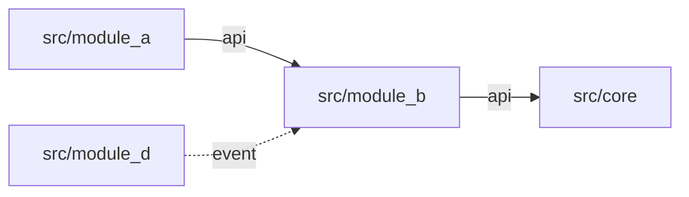
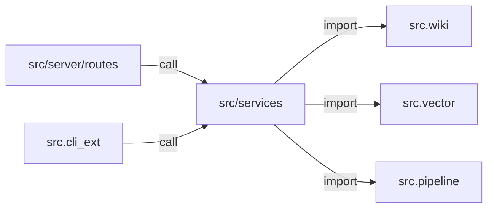

# 模块化架构文档模板

> 填完此模板，模块架构对新人和 AI 一目了然。
> 每新增/重构一个模块，复制此模板填写，存入 `docs/arch/`。

---

## 模块名称

`src/<module_path>/` — 简短说明

## 职责边界

| 维度 | 描述 |
|------|------|
| 本模块负责 | **只做**什么 |
| 本模块不负责 | **明确不做**什么（边界） |
| 依赖的模块 | 导入哪些外部模块的 `api` / `__init__` |
| 被哪些模块依赖 | 哪些模块导入本模块的对外 API |

## 目录结构

```
src/<module>/
├── __init__.py      # ✅ 唯一对外入口，重导出公开符号
├── types.py         # 对外契约：类型、接口、数据结构
├── service/         # 内部业务逻辑 [私有]
├── model/           # 内部数据模型 [私有]
├── utils/           # 内部工具函数 [私有]
└── tests/           # 单元测试
```

## 对外 API 契约

### 公开函数/类

| 签名 | 说明 | 入参 | 返回值 | 错误 |
|------|------|------|--------|------|
| `func_x(a: str, b: int) -> Result` | 简述 | `a`: 描述<br>`b`: 描述 | `Result` 结构 | 抛 `XError` 当… |

> 只有 `__init__.py` 中 `__all__` 列出的符号是对外契约。外部模块禁止导入 `service/` `model/` `utils/` 内部文件。

### 事件

| 事件名 | 载荷 | 方向 | 说明 |
|--------|------|------|------|
| `module:event_name` | `EventPayload` | emit → consume | 触发时机 |

## 依赖关系图



## 循环依赖规避策略

| 涉及模块 | 风险 | 解决方式 |
|----------|------|----------|
| A ↔ B | 双向 import | 抽取公共类型至 `core/` / 改为事件驱动 |

## 架构决策记录

> 重要设计决策记入 `docs/adr/`，此处只列索引。

| ADR 文件 | 决策摘要 |
|----------|----------|
| `docs/adr/xxx.md` | 为什么选事件总线而非直接调用 |

---

## 填写示例（以当前 ruflo-kb 的服务层为例）

### 模块名称

`src/services/` — 业务逻辑层，HTTP 路由与核心领域之间的中介

### 职责边界

| 维度 | 描述 |
|------|------|
| 本模块负责 | 参数校验、编排领域逻辑、返回结果 |
| 本模块不负责 | HTTP 状态码、路由注册、请求/响应序列化 |
| 依赖的模块 | `src.wiki.core`, `src.wiki.features`, `src.vector`, `src.pipeline` |
| 被哪些模块依赖 | `src.server.routes.*`, `src.cli_ext.*` |

### 目录结构

```
src/services/
├── __init__.py       # 可选的便捷 re-export
├── files.py          # 文件操作服务
├── projects.py       # 项目管理服务
├── schema.py         # schema 迁移服务
├── reviews.py        # review 服务
├── ingest.py         # 内容摄入服务
├── search.py         # 搜索服务
└── chat.py           # 聊天服务
```

### 对外 API 契约

| 签名 | 说明 | 入参 | 返回值 | 错误 |
|------|------|------|--------|------|
| `ingest.enqueue_source(project_id, source, ctx, paths)` | 入队一个摄入任务 | `project_id: str`, `source: dict`, `ctx: ProjectContext`, `paths: WikiPaths` | `dict: {status, taskId}` | `HTTPException(404)` 当项目不存在 |
| `search.search(project_id, query, ctx, paths)` | 混合搜索 | `query: str`, `mode: str` | `list[SearchResult]` | — |

### 依赖关系图

