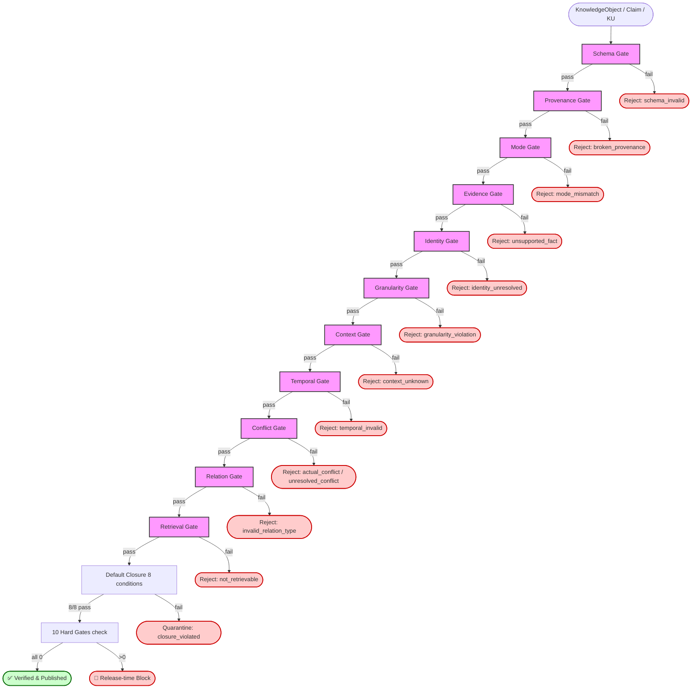

# B-2 11 Gate 依赖图 + 接口设计（路线 v2.2 §B-2 起步规划）

> **任务**：路线 v2.2 §B-2 design phase，纯规划任务（0 改代码 + 0 改路线文档）
> **状态**：B-2 design phase，待用户决策是否进入实施
> **作者**：路线执行 subagent
> **路线章节**：`docs/superpowers/plans/2026-08-26-kc-spec-roadmap.md` §B-2 + §B-2.5 + §B-2.6 + §11 v2.2 补位
> **spec 来源**：`output/DEVELOPMENT_PLAN.md` §11 + §14 A5 + §11.4 硬门槛

---

## 目录

1. [背景与目标](#1-背景与目标)
2. [11 Gate 依赖图](#2-11-gate-依赖图-mermaid)
3. [每个 Gate 的接口设计](#3-每个-gate-的接口设计)
   - 3.1 Schema Gate
   - 3.2 Provenance Gate
   - 3.3 Evidence Gate
   - 3.4 Mode Gate
   - 3.5 Identity Gate
   - 3.6 Granularity Gate
   - 3.7 Context Gate
   - 3.8 Temporal Gate
   - 3.9 Conflict Gate
   - 3.10 Relation Gate
   - 3.11 Retrieval Gate
4. [默认发布闭包 8 条件（spec §11.3）](#4-默认发布闭包-8-条件spec-113)
5. [10 类硬门槛（spec §11.4）](#5-10-类硬门槛spec-114)
6. [v2.2 重大补位整合](#6-v22-重大补位整合)
7. [实施拆分（路线 v2.2 B-2 plan）](#7-实施拆分路线-v22-b-2-plan)
8. [spec §14 A5 Gate 验收（spec §14 A5）](#8-spec-14-a5-gate-验收spec-14-a5)
9. [风险与缓解](#9-风险与缓解)
10. [路线 v2.2 后续](#10-路线-v22-后续)
11. [文档关联](#11-文档关联)

---

## 1. 背景与目标

### 1.1 spec §11 概览

spec §11 定义 KC v2.1 的核心安全闸门：**11 Integrity Gate**（§11.2）+ **默认发布闭包 8 条件**（§11.3）+ **10 类硬门槛**（§11.4）。三者协同确保**已发布**对象满足：

- **schema 合法**（Schema Gate）
- **能回到 Raw Source**（Provenance Gate）
- **Evidence 足够强**（Evidence Gate）
- **Mode 标签一致**（Mode Gate）
- **Identity 可解释**（Identity Gate）
- **粒度合适**（Granularity Gate）
- **Context 明确**（Context Gate）
- **时间自洽**（Temporal Gate）
- **冲突被处理**（Conflict Gate）
- **关系在受控集合内**（Relation Gate）
- **默认检索可被找到**（Retrieval Gate）

### 1.2 B-2 在路线 v2.2 的位置

```
C 段（止血 + 评估基建）─ C-0 / C-1 / C-2 / C-3 / C-3.5 / C-4 / C-4.5（已完成）
                              ↓
A 段（纪律 + 关键结构）  ─ A-0 / A-1 / A-2 / A-3 / A-4 / A-5 / A-7（已完成）
                              ↓
B 段 ─ B-1 Semantic Support ✅
                              ↓
                  B-2 11 Gate（本文档 + 即将实施）← 当前任务
                              ↓
            ┌─────────┬─────────┬─────────┐
            ↓         ↓         ↓         ↓
       B-2.5      B-2.6     B-3      B-3.5/B-3.6
   identity_key  Health    8 闭包    Wiki/Book
   总验收        Report    + 30 天   重建演练
                              ↓
                  B-4 / B-5 / B-5.5 / B-5.6
```

### 1.3 B-2 前置依赖（A 段 + C 段全部就绪）

| Gate | spec 章节 | 已就绪依赖 | 代码位置 | 状态 |
|---|---|---|---|---|
| 1. Schema Gate | §11.2 | C-4.5 Structured Fact schema | `src/kc/contracts/structured_fact.py` | ✅ |
| 2. Provenance Gate | §11.2 + §5.7 | C-1 Evidence + C-0.4 evidence_refs | `src/kc/contracts/evidence.py` | ✅ |
| 3. Evidence Gate | §11.2 + §6 | C-1 Evidence + B-1 SemanticSupportChecker + C-1 StrengthPolicy | `src/kc/semantic_support/checker.py` + `src/kc/contracts/strength_policy.py` | ✅ |
| 4. Mode Gate | §11.2 + §7 | C-4 KnowledgeMode + 5 截断 fail-closed | `src/kc/contracts/mode.py` | ✅ |
| 5. Identity Gate | §11.2 + §5.4 + §9 | A-1 KnowledgeUnit + identity_key + A-4 Approval | `src/kc/domain/knowledge_unit.py` + `src/kc/governance/approval.py` | ✅ |
| 6. Granularity Gate | §11.2 + §4 | A-1 KnowledgeUnit + `should_split_ku`/`should_merge_ku` | `src/kc/domain/knowledge_unit.py` | ✅ |
| 7. Context Gate | §11.2 + §8.3 + §5.1 | A-3 ConflictClassifier 6 类型 + K-5 Taxonomy 映射 | `src/kc/conflicts/classifier.py` | ✅ |
| 8. Temporal Gate | §11.2 + §10 | A-2 derive_status + valid_from/valid_to 字段 | （A-2 任务交付时落地） | ✅ |
| 9. Conflict Gate | §11.2 + §8.2 | A-3 ConflictClassifier | `src/kc/conflicts/classifier.py` | ✅ |
| 10. Relation Gate | §11.2 + §3.6 | **未开工**（spec §3.6 9 类关系；WikiPage.relations 既有 17 类需收敛） | （待设计 ADR） | 🟡 需 design |
| 11. Retrieval Gate | §11.2 + §12.1 | C-2 DefaultFilter（workflow_state）+ A-2 apply_temporal_filter（temporal）+ B-1 SemanticSupportChecker（evidence） | `src/kc/retrieval/filter.py` + `src/kc/semantic_support/checker.py` | ✅ |

**A 段已交付 8 个 KC 子模块**（src/kc/ 下共 13 个模块）：

```
src/kc/
├── adapters/        # 投影到 WikiPage 等视图层
├── api.py           # compile_text / compile_source（最小 API seam）
├── backup/          # Core 快照 / 还原（C-0.5a 已完成）
├── compiler/        # 编译流水线（normalize / extract / evidence / verify / compile）
├── conflicts/       # A-3 ConflictClassifier 6 类型
├── contracts/       # Evidence / StructuredFact / PublicationState / StrengthPolicy / Mode
├── domain/          # A-1 KnowledgeUnit + identity_key（A-1 已完成）
├── evidence/        # C-1 Evidence 一等公民（storage.py 已落地）
├── extraction/      # C-4.5 Structured Fact 抽取路径
├── governance/      # A-4 Approval（已落地）
├── retrieval/       # C-2 DefaultFilter（A-2 task 占位）
├── semantic_support/# B-1 SemanticSupportChecker（已落地）
└── views/           # 视图投影
```

### 1.4 目标

把 11 Gate 设计成**可独立实施**、**可独立验收**、**可独立回滚**的单元：

1. **依赖图先于实施**——避免循环依赖（本文档第 2 节）
2. **每个 Gate 接口统一**——`(obj, context) -> GateVerdict`，便于流水线串联
3. **错误注入 100% blocked**——每个 Gate 必须有反向测试，模拟违例场景，验证 verdict=fail
4. **失败可审计**——每个 verdict 携带 `reason_codes` + `severity`，与 A-0 delivery_report 兼容
5. **现有代码复用最大化**——所有 Gate 优先组合现有模块（KnowledgeUnit/ConflictClassifier/SemanticSupportChecker/DefaultFilter），不引入重复实现

---

## 2. 11 Gate 依赖图（Mermaid）



### 2.1 关键依赖说明

| # | 依赖 | 理由 |
|---|---|---|
| 1 | Schema 在最前 | 所有 Gate 都依赖字段存在；Schema 不过则后续 Gate 无从判定（fail-fast） |
| 2 | Provenance 在 Schema 之后 | Provenance 字段（structured_provenance / computation_provenance）必须先存在才能验证 |
| 3 | Mode 在 Schema 之后 | knowledge_mode 字段依赖 schema 先合法 |
| 4 | Evidence 依赖 Provenance | 证据必须有来源（direct_quote → document_id/block_id 必填） |
| 5 | Identity 在 Evidence 之后 | identity_key 依赖 claim_ids / structured_fact_ids 字段存在 |
| 6 | Granularity 在 Identity 之后 | KU 拆分决策需要先有 identity 才能判定（同 identity 不应拆） |
| 7 | Context 在 Granularity 之后 | Context 字段在 KU/Claim 粒度确定后才能正确映射 |
| 8 | Temporal 在 Context 之后 | temporal_status 与 context_policy_version 绑定（K-5 加固） |
| 9 | Conflict 在 Context + Temporal 之后 | 6 类冲突分类需要 context + validity 两个维度的输入 |
| 10 | Relation 在 Conflict 之后 | 新增 relation 前需确认不与现有冲突链路冲突 |
| 11 | Retrieval 在最末 | 其他 Gate 都通过后才进入默认检索（避免污染结果集） |

### 2.2 流水线入口契约

```python
# src/kc/integrity/pipeline.py（B-2.1 待新建）
@dataclass(frozen=True)
class GateVerdict:
    """11 Gate 共用的 verdict 值对象（spec §11.2）。"""
    gate_name: str                  # "schema" / "provenance" / ...
    passed: bool                    # True = pass, False = fail
    reason_codes: tuple[str, ...]  # 触发的失败码（空 tuple = pass）
    severity: Literal["block", "warn", "info"] = "block"
    evidence_refs: tuple[str, ...] = ()  # 触发该 verdict 的 Evidence IDs

# 流水线入口
def run_all_gates(obj: KnowledgeObject) -> IntegrityReport:
    """spec §11.2 完整流水线 — 11 Gate 按依赖顺序串行。"""
    ...
```

---

## 3. 每个 Gate 的接口设计

### 3.1 Schema Gate

```python
class SchemaGate:
    """spec §11.2 Gate 1: 对象符合版本化 Schema。"""

    def check(self, obj: KnowledgeObject | Claim | KU) -> GateVerdict:
        # 1. 验证 KnowledgeObject 所有必填字段存在 + 类型正确
        #    - ku_id / concept_id / question / title / unit_type / knowledge_mode
        # 2. 验证 StructuredFact schema (C-4.5 已完成 — src/kc/contracts/structured_fact.py)
        #    - subject / field / value / value_type 必填
        # 3. 验证 Evidence schema (C-1 已完成 — src/kc/contracts/evidence.py)
        #    - evidence_id / document_id / block_id / quote 必填
        # 4. 验证 Conflict schema (A-3 已完成 — src/kc/conflicts/classifier.py)
        #    - conflict_type 在 6 类 Literal 中
```

- **输入**：`KnowledgeObject` / `Claim` / `KnowledgeUnit` / `StructuredFact` / `Evidence`（任意一种 KC 对象）
- **输出**：`GateVerdict(passed, reason_codes, severity)`
- **失败模式**：
  - 必填字段缺失 → `SCHEMA_FIELD_MISSING`
  - 字段类型错误 → `SCHEMA_TYPE_MISMATCH`
  - enum 值越界 → `SCHEMA_VALUE_OUT_OF_RANGE`
- **实现依赖**：spec §5.4 (KU schema) + §5.6 (SF schema) + §5.7 (Evidence schema) + §5.11 (Conflict/Approval schema)
- **现有代码位置**：`src/kc/contracts/` 下 5 个 dataclass（已落地）
- **测试策略**：错误注入（缺失字段 / 类型错 / enum 越界）100% 触发 fail；正向测试覆盖 spec §5.4 全部 8 种 UnitType + 6 种 KUStatus

---

### 3.2 Provenance Gate

```python
class ProvenanceGate:
    """spec §11.2 Gate 2: 能回到 Canonical Document 与 Raw Source。"""

    def check(self, obj: KnowledgeObject | Claim) -> GateVerdict:
        # 1. C-0.4 evidence_refs 字段验证
        #    - obj.evidence_refs 非空 + 至少 1 条 Evidence
        #    - 每条 Evidence 的 document_id / block_id 可解析到 Raw Source
        # 2. Raw Source hash 匹配（Z-9 延后 — 现状 md5；未来 sha256）
        # 3. Correction Record 链完整性（spec §5.1）
        #    - 若 Raw Source 有 corrected_by → Correction Record 必填且未 broken
```

- **输入**：`KnowledgeObject`（含 `evidence_refs: list[str]`）
- **输出**：`GateVerdict`
- **失败模式**：
  - `evidence_refs` 为空 → `PROVENANCE_MISSING_EVIDENCE`
  - Evidence.document_id 不可解析 → `PROVENANCE_BROKEN_LINK`
  - Evidence.block_id 不存在 → `PROVENANCE_BLOCK_NOT_FOUND`
  - Raw Source hash 不匹配（sha256 上线后）→ `PROVENANCE_HASH_MISMATCH`
  - Correction Record 链断 → `PROVENANCE_CORRECTION_BROKEN`
- **实现依赖**：spec §5.7（Evidence 含 provenance 字段）+ §5.1（Correction Record）+ §3.3 P-3（Z-9 md5 → sha256 延后 ADR）
- **现有代码位置**：`src/kc/contracts/evidence.py`（已含 `structured_provenance` + `computation_provenance`）
- **测试策略**：
  - 缺 `evidence_refs` → fail
  - Evidence.document_id 指向不存在文件 → fail
  - 模拟 sha256 切换前后哈希差异 → fail（Z-9 上线时验证）

---

### 3.3 Evidence Gate

```python
class EvidenceGate:
    """spec §11.2 Gate 3: 满足 Evidence Strength Policy + Semantic Support。"""

    def check(self, claim: Claim, evidence_list: list[Evidence]) -> GateVerdict:
        # 1. StrengthPolicy (C-1) 评估每条 Evidence 强度
        #    - observed+fact 至少 1 strong 或 2 medium (spec §6 E-3)
        #    - inferred 单独不支撑 observed fact (E-4)
        #    - computed 缺 input_ids/algorithm/algorithm_version/result_hash → weak (E-14)
        #    - structured_source 缺 schema_id/record_key/field_path → weak (E-15)
        # 2. SemanticSupportChecker (B-1) 检查蕴含 + 范围 + 时间限定
        #    - Span 可定位是必要条件（非充分）
        #    - supports / partially_supports 才算支持
        #    - contradicts → 阻断发布（移交 Conflict Gate）
        #    - irrelevant / insufficient → 视为无支持
```

- **输入**：`Claim` + 关联 `list[Evidence]`
- **输出**：`GateVerdict`
- **失败模式**：
  - `Claim.evidence_ids` 为空 → `EVIDENCE_UNSUPPORTED_FACT`
  - 所有 Evidence 均为 weak 且数量 < 2 → `EVIDENCE_INSUFFICIENT`
  - 强类型 Evidence（strong/medium）数量不满足 E-3 → `EVIDENCE_STRENGTH_INSUFFICIENT`
  - SemanticSupportChecker 输出 `contradicts` → `EVIDENCE_CONTRADICTS_CLAIM`
  - SemanticSupportChecker 输出 `irrelevant` / `insufficient` → `EVIDENCE_NOT_SUPPORTING`
- **实现依赖**：spec §6 (E-1 ~ E-15) + §A2 Gate (SemSupport Accuracy ≥ 0.95)
- **现有代码位置**：
  - `src/kc/contracts/strength_policy.py`（C-1 已落地）
  - `src/kc/semantic_support/checker.py`（B-1 已落地，含 `SupportVerdict`）
- **测试策略**：
  - 错误注入：空 evidence → fail；全 weak + 1 条 → fail；inferred alone → fail
  - 语义反向：claim "快" vs evidence "慢" → contradicts → fail
  - 与 B-1 已落地的 50 元/日上限配合（cost_used_cny < cost_limit_cny）

---

### 3.4 Mode Gate

```python
class ModeGate:
    """spec §11.2 Gate 4: Observed/Synthesized 标记及来源完整。"""

    def check(self, claim: Claim | KnowledgeUnit) -> GateVerdict:
        # 1. knowledge_mode 字段必填 (C-4 已落地 K-2 fail-closed)
        #    - parse_knowledge_mode(value) → Literal["observed","synthesized","unknown"]
        #    - 截断 5 场景全兜底为 "unknown"
        # 2. Synthesized 必须有 derived_from + Provenance + 至少 1 个非 inferred Evidence
        # 3. Observed 不能混层 (spec §11.4 #3)
        #    - KU.knowledge_mode == observed + 内部 Claim 任意 = synthesized → 阻断
```

- **输入**：`Claim` 或 `KnowledgeUnit`
- **输出**：`GateVerdict`
- **失败模式**：
  - `knowledge_mode == "unknown"` → `MODE_UNKNOWN_FAIL_CLOSED`
  - Synthesized 但 `derived_from` 为空 → `MODE_SYNTHESIZED_NO_DERIVATION`
  - Synthesized 但 Evidence 全为 inferred → `MODE_SYNTHESIZED_WEAK_ONLY`
  - Observed KU 混层 Synthesized Claim → `MODE_LAYER_MIXING`
  - `detect_truncation` 返回非 None → `MODE_TRUNCATION_FAIL_CLOSED`（C-4 K-2 加固 5 种）
- **实现依赖**：spec §7 + §A2 Gate (Mode truncation 100% fail-closed)
- **现有代码位置**：`src/kc/contracts/mode.py`（C-4 已落地，含 `parse_knowledge_mode` / `detect_truncation` / `parse_llm_output_with_mode`）
- **测试策略**：
  - 5 种截断场景 100% fail（已有）
  - Synthesized + 缺 derived_from → fail
  - Synthesized + 全 inferred evidence → fail
  - Observed KU + 混 Synthesized Claim → fail

---

### 3.5 Identity Gate

```python
class IdentityGate:
    """spec §11.2 Gate 5: 概念归属和别名解析可解释。"""

    def check(self, claim_or_ku: Claim | KnowledgeUnit) -> GateVerdict:
        # 1. A-1 KnowledgeUnit identity_key 唯一性
        #    - knowledge_unit.identity_key (id-v1 算法已实现)
        #    - 数据库级约束：同 type + 同 identity-bearing fields → 同 identity_key
        # 2. A-4 Approval 已批准 (merge / split / supersede / concept_identity_change)
        #    - approval.status == "approved" 且 operation 与请求一致
        # 3. B-2.5 identity_key 总验收（v2.2 补位 #1）触发位置
        #    - 13 行 identity_key 字段一致性校验（详见 §6.1）
```

- **输入**：`Claim` 或 `KnowledgeUnit`
- **输出**：`GateVerdict`
- **失败模式**：
  - 同 identity_key 但 status 不同 → `IDENTITY_DUPLICATE`（merge-reviewed 路径触发 Approval）
  - merge / split / supersede / identity_change 未通过 Approval → `IDENTITY_UNAPPROVED_CHANGE`
  - identity_key 缺失必填字段 → `IDENTITY_KEY_INCOMPLETE`（B-2.5）
- **实现依赖**：spec §5.4 + §5.11 Approval + §14 A4-3（确定性 identity_key 和唯一约束）
- **现有代码位置**：
  - `src/kc/domain/knowledge_unit.py`（A-1 已落地 `KnowledgeUnit` + `compute_ku_identity_key` + `ResolutionEvent`）
  - `src/kc/governance/approval.py`（A-4 已落地 `Approval` + `ApprovalGate.check_authorization`）
- **测试策略**：
  - 同 identity-bearing fields → 同 identity_key（确定性）
  - merge / split 无 Approval → 阻断
  - B-2.5 13 行 identity_key 字段一致性校验（详见 §6.1）

---

### 3.6 Granularity Gate

```python
class GranularityGate:
    """spec §11.2 Gate 6: 对象粒度符合三层模型。"""

    def check(self, ku: KnowledgeUnit) -> GateVerdict:
        # 1. A-1 should_split_ku 判定
        #    - internal_questions > 1 → 应拆
        #    - not same_platform / not same_audience → 应拆
        #    - not time_ranges_overlap → 应拆
        #    - update_correlation < 0.5 → 应拆
        # 2. A-1 should_merge_ku 判定（反向）
        #    - 同 question + context 兼容 + time 兼容 + 可独立检索 + 无隐藏冲突 → 可合
        # 3. KU 必能用一个问题描述 (spec §4.2)
        # 4. 拆分/合并决策写入 resolution_event (spec §5.11)
```

- **输入**：`KnowledgeUnit`
- **输出**：`GateVerdict`
- **失败模式**：
  - `should_split_ku` 返回 True 但 KU 未拆 → `GRANULARITY_SHOULD_SPLIT`
  - `should_merge_ku` 返回 True 但 KU 未合 → `GRANULARITY_SHOULD_MERGE`
  - KU 缺 `question` 字段 → `GRANULARITY_NO_QUESTION`
- **实现依赖**：spec §4.2 + §4.4
- **现有代码位置**：`src/kc/domain/knowledge_unit.py`（A-1 已落地 `should_split_ku` + `should_merge_ku`）
- **测试策略**：
  - 5 种拆分条件任一满足 → 应拆（已有逻辑测试）
  - 5 种合并条件全部满足 → 可合（已有逻辑测试）
  - KU 无 question 字段 → fail

---

### 3.7 Context Gate

```python
class ContextGate:
    """spec §11.2 Gate 7: 适用范围明确或标记 unknown。"""

    def check(self, claim_or_ku: Claim | KnowledgeUnit) -> GateVerdict:
        # 1. A-3 ConflictClassifier 6 类型分类（Context 维度）
        # 2. K-5 Taxonomy → Context 映射
        #    - 旧 category → Context.domain
        #    - 旧 taxonomy_sub → Context.platform
        # 3. spec §8.3 5 匹配语义
        #    - 完全匹配 / 部分匹配 / 不匹配 / 未知 / 强制
        # 4. unknown 维度 → unresolved (spec §8.2 X-9)
```

- **输入**：`Claim` 或 `KnowledgeUnit`
- **输出**：`GateVerdict`
- **失败模式**：
  - 必填 Context 维度为 `unknown` → `CONTEXT_DIMENSION_UNKNOWN`
  - Context 维度未通过 K-5 Taxonomy 映射 → `CONTEXT_TAXONOMY_UNMAPPED`
  - Context 8 维全部 unknown → `CONTEXT_ALL_UNKNOWN`
- **实现依赖**：spec §8.3 + §5.1 + K-5 Taxonomy 映射
- **现有代码位置**：
  - `src/kc/conflicts/classifier.py`（A-3 已落地 `_context_disjoint` / `_context_partial_overlap` / `_has_unknown_dimension`）
  - `docs/migration/taxonomy_to_context_mapping.md`（K-5 已落地）
- **测试策略**：
  - 8 维中任一 unknown → fail
  - Taxonomy 未映射 → fail
  - 与 A-3 Conflict Classifier 共享 `_has_unknown_dimension` 测试

---

### 3.8 Temporal Gate

```python
class TemporalGate:
    """spec §11.2 Gate 8: 时间字段自洽，无非法重叠。"""

    def check(self, obj: Claim | KU | StructuredFact) -> GateVerdict:
        # 1. A-2 derive_status 派生
        #    - current / historical / unknown
        #    - valid_from=None 显式 unknown（spec §10 L-6 加固）
        # 2. valid_from <= valid_to 校验
        # 3. 跨 KU 时间无冲突
        #    - 同 identity 的 KU 之间 valid_from 不重叠
```

- **输入**：`Claim` / `KnowledgeUnit` / `StructuredFact`（任一带 `valid_from`/`valid_to`）
- **输出**：`GateVerdict`
- **失败模式**：
  - `valid_from > valid_to` → `TEMPORAL_INVALID_RANGE`
  - `valid_from=None` 但期望 current → `TEMPORAL_UNKNOWN_FAIL_CLOSED`
  - 跨 KU 时间重叠且无 supersede 关系 → `TEMPORAL_UNEXPECTED_OVERLAP`
- **实现依赖**：spec §10 + A-2 L-6 加固（`valid_from=None` 显式 unknown）
- **现有代码位置**：（A-2 任务交付时落地 `src/kc/compiler/temporal.py`）
- **测试策略**：
  - valid_from > valid_to → fail
  - valid_from=None → unknown → 不进默认检索（L-6 已覆盖）
  - 跨 KU 重叠无 supersede → fail

---

### 3.9 Conflict Gate

```python
class ConflictGate:
    """spec §11.2 Gate 9: 真实冲突不被静默覆盖。"""

    def check(self, claim: Claim, candidate: Claim) -> GateVerdict:
        # 1. A-3 ConflictClassifier 输出 6 类型之一
        # 2. actual / unresolved → 阻断默认发布（spec §11.4 #6 / #7）
        # 3. conditional / temporal / perspective / none → 允许但带限定
```

- **输入**：`Claim` + 待比较 `Claim`（成对判定）
- **输出**：`GateVerdict`
- **失败模式**：
  - `conflict_type == "actual"` → `CONFLICT_ACTUAL`（阻断默认发布）
  - `conflict_type == "unresolved"` → `CONFLICT_UNRESOLVED`（阻断默认发布）
  - `conflict_type == "temporal"` 但未触发 supersede → `CONFLICT_TEMPORAL_NOT_SUPERSEDED`
- **实现依赖**：spec §8.2 + §11.4 #6/#7
- **现有代码位置**：`src/kc/conflicts/classifier.py`（A-3 已落地 `ConflictClassifier.classify` + 6 类型 Literal）
- **测试策略**：
  - 6 类型各 2 case（已有 A-3 6 测试）
  - actual → 阻断；unresolved → 阻断
  - temporal → 必须 supersede 才放行
  - 与 B-3 8 闭包条件联动（不阻断 publish 但阻断 default retrieval）

---

### 3.10 Relation Gate

```python
class RelationGate:
    """spec §11.2 Gate 10: 关系类型在受控集合中。"""

    def check(self, relation: Relation) -> GateVerdict:
        # 1. spec §3.6 9 类关系（受控集合）
        #    is_a / part_of / related_to / depends_on /
        #    supports / contradicts / example_of / supersedes / derived_from
        # 2. WikiPage.relations 既有 17 类需收敛（Relation ADR 留位）
        #    - x-* 自定义关系 → 仅在 ADR 批准后接受
        # 3. 新增关系需 Relation ADR (spec §3.6)
```

- **输入**：`Relation`（type / from_ref / to_ref / context_id / validity_id）
- **输出**：`GateVerdict`
- **失败模式**：
  - relation_type 不在 9 类受控集合 → `RELATION_TYPE_INVALID`
  - x-* 自定义未登记 ADR → `RELATION_UNREGISTERED`
  - supports / contradicts 关系与 Conflict Gate 输出矛盾 → `RELATION_CONFLICT_MISMATCH`
- **实现依赖**：spec §3.6（9 类关系）
- **现有代码位置**：
  - `src/wiki/core/types.py` 中 `Relation` 类型（含 17 built-in + `x-*`）
  - **缺失**：9 类受控集合常量 + Relation ADR 模板
- **测试策略**：
  - 17 类中 8 类（is_a / part_of / related_to / depends_on / supports / contradicts / example_of / supersedes）通过；其余 9 类（含 derived_from）需 ADR 批准
  - x-* 自定义 → 仅在 `.kc/relation_registry.yaml` 登记后通过
- **🟡 待 design**：Relation Gate 是唯一**前置依赖未完成**的 Gate，需在 B-2.5 之前产出 Relation ADR 模板（详见 §9 风险表）

---

### 3.11 Retrieval Gate

```python
class RetrievalGate:
    """spec §11.2 Gate 11: 发布对象可按 ID、主题和证据链检索。"""

    def check(self, claim_or_ku: Claim | KU) -> GateVerdict:
        # 1. C-2 DefaultFilter (workflow_state) 已在 src/kc/retrieval/filter.py 落地
        #    - workflow_state == "verified" 通过
        #    - _ko_extra.lifecycle ∈ {DISPUTED, QUARANTINED, CANDIDATE, REJECTED} 阻断
        # 2. A-2 apply_temporal_filter (temporal) — 待 A-2 落地
        #    - temporal_status ∈ {current, unknown} 通过
        # 3. B-1 SemanticSupportChecker (evidence) — 已落地
        #    - 任何 support_type ∈ {supports, partially_supports} 通过
        # 4. hybrid_search 集成（C-2.5 待做 — B-2.8 任务）
```

- **输入**：`Claim` 或 `KnowledgeUnit`（最终候选对象）
- **输出**：`GateVerdict`
- **失败模式**：
  - workflow_state ≠ verified → `RETRIEVAL_NOT_VERIFIED`
  - lifecycle ∈ {DISPUTED, QUARANTINED, CANDIDATE, REJECTED} → `RETRIEVAL_LIFECYCLE_BLOCKED`
  - temporal_status = historical → `RETRIEVAL_TEMPORAL_HISTORICAL`
  - 所有 evidence 支持不足 → `RETRIEVAL_NO_SEMANTIC_SUPPORT`
- **实现依赖**：spec §11.3 + §12.1
- **现有代码位置**：
  - `src/kc/retrieval/filter.py`（C-2 已落地 `DefaultFilter.passes` + `apply_default_filter`）
  - `src/kc/semantic_support/checker.py`（B-1 已落地）
  - **缺失**：A-2 `apply_temporal_filter` + hybrid_search 集成（C-2.5，B-2.8 任务）
- **测试策略**：
  - workflow_state=verified + lifecycle=None + temporal=current → pass
  - 任意 lifecycle 阻断 → fail（已有 C-2 5 测试 + 错误注入）
  - 与 B-3 8 闭包条件串联

---

## 4. 默认发布闭包 8 条件（spec §11.3）

```python
DEFAULT_CLOSURE = [
    "1. Unit.status = verified",
    "2. Concept.status = verified",
    "3. Unit.knowledge_mode 与全部可见 Claim/Fact 一致",
    "4. Synthesized: 每个 Claim 有 Provenance + derived_from 非空 + approved",
    "5. 每个可见 Claim.status = verified",
    "6. 每个支撑 Evidence.status = active",
    "7. 每个 Source Trust Profile.status = accepted",
    "8. Context Resolution != unresolved",
    "9. Temporal Status = current",
    "10. 不存在 open actual/unresolved Conflict",
]
```

> **注意**：spec §11.3 字面定义 8 条件，但路线 v2.2 B-3 实施时按 10 条展开（细分 4 与 8）。本表保留两套对齐视图——spec 字面 8 条 + 实施细分 10 条，二者**不冲突**。

### 4.1 闭包验证函数

```python
# src/kc/publish/closure.py（B-3 待新建，B-2.7 任务内预埋接口）
@dataclass(frozen=True)
class ClosureReport:
    """spec §11.3 8 条件验证结果。"""
    object_id: str
    conditions_passed: tuple[str, ...]  # 全部条件 ID
    conditions_failed: tuple[tuple[str, str], ...]  # [(condition_id, reason_code)]
    all_passed: bool  # conditions_failed == ()

def check_default_closure(obj: KnowledgeObject) -> ClosureReport:
    """spec §11.3 默认发布闭包验证 — 全部条件 AND。"""
    failures: list[tuple[str, str]] = []

    # 1. Unit.status = verified
    if obj.status != "verified":
        failures.append(("unit_status", "CLOSURE_UNIT_NOT_VERIFIED"))

    # 2. Concept.status = verified
    if obj.concept_status != "verified":  # 由 A-1 注入字段
        failures.append(("concept_status", "CLOSURE_CONCEPT_NOT_VERIFIED"))

    # 3. Unit.knowledge_mode 与全部可见 Claim/Fact 一致
    for claim in obj.claims:
        if claim.knowledge_mode != obj.knowledge_mode:
            failures.append(("mode_consistency", "CLOSURE_MODE_MIXED"))

    # 4. Synthesized: 每个 Claim 有 Provenance + derived_from 非空 + approved
    if obj.knowledge_mode == "synthesized":
        for claim in obj.claims:
            if not claim.evidence_refs or not claim.derived_from:
                failures.append(("synthesized_provenance", "CLOSURE_SYNTHESIZED_NO_DERIVATION"))
            if not claim.approval_id:
                failures.append(("synthesized_approval", "CLOSURE_SYNTHESIZED_NO_APPROVAL"))

    # 5. 每个可见 Claim.status = verified
    for claim in obj.claims:
        if claim.status != "verified":
            failures.append(("claim_status", "CLOSURE_CLAIM_NOT_VERIFIED"))

    # 6. 每个支撑 Evidence.status = active
    for evidence_id in obj.evidence_refs:
        ev = evidence_storage.read(evidence_id)
        if ev is None or ev.status != "active":
            failures.append(("evidence_status", "CLOSURE_EVIDENCE_NOT_ACTIVE"))

    # 7. 每个 Source Trust Profile.status = accepted
    # (C-0 / C-1 阶段 Source Trust Profile 尚未完全落地，详见 §9 风险)

    # 8. Context Resolution != unresolved
    if obj.context_resolution == "unresolved":
        failures.append(("context_resolution", "CLOSURE_CONTEXT_UNRESOLVED"))

    # 9. Temporal Status = current (L-6 加固)
    if obj.temporal_status not in ("current", "unknown"):
        failures.append(("temporal_status", "CLOSURE_TEMPORAL_NOT_CURRENT"))

    # 10. 不存在 open actual/unresolved Conflict
    for conflict in obj.open_conflicts:
        if conflict.conflict_type in ("actual", "unresolved"):
            failures.append(("conflict_open", "CLOSURE_CONFLICT_OPEN"))

    return ClosureReport(
        object_id=obj.ku_id,
        conditions_passed=tuple(f"condition_{i+1}" for i in range(10)),
        conditions_failed=tuple(failures),
        all_passed=len(failures) == 0,
    )
```

### 4.2 30 天过渡期（H-2 + K-1 加固）

| 阶段 | 行为 | CLI 命令 |
|---|---|---|
| Day 0-7 | 闭包 OFF（legacy 兼容）+ 警告日志 | `python -m src.cli kc enable-closure --preview` |
| Day 8-30 | 闭包 ON 但 warning-only（不阻断 publish） | `python -m src.cli kc enable-closure --dry-run` |
| Day 30+ | 闭包 ON + 硬阻断 | `python -m src.cli kc enable-closure --confirm` |
| Legacy 兜底 | `verified_at = ingestion_unix_ms` 机械化 backfill | `python -m src.cli kc migrate-legacy` |

---

## 5. 10 类硬门槛（spec §11.4）

| # | 硬门槛 | 阻断条件 | 对应 Gate | 现有度量 |
|---|---|---|---|---|
| 1 | Unsupported Fact > 0 | Claim 无 Evidence | Evidence Gate | C-2 已可测量 |
| 2 | Critical Evidence Missing > 0 | 必须 Evidence 缺失 | Evidence Gate | C-2 已可测量 |
| 3 | Observed/Synthesized 混层 > 0 | Mode 标签冲突 | Mode Gate | C-4 已可测量 |
| 4 | 无审计 merge/supersede > 0 | 无 Approval | Identity Gate (A-4 已落地) | A-4 已可测量 |
| 5 | Broken Provenance Link > 0 | Raw/Canonical 链断 | Provenance Gate | 待 B-2.1 |
| 6 | Actual Conflict 被覆盖 > 0 | actual 冲突被合并 | Conflict Gate | A-3 已可测量 |
| 7 | Unresolved Conflict 被发布 > 0 | unresolved 状态发布 | Conflict Gate | A-3 已可测量 |
| 8 | Published Dependency Closure Error > 0 | 依赖未发布 | Default Closure | B-3 待做 |
| 9 | Evidence Semantic Support Error > 0 | SemSupport fail | Evidence Gate (B-1 已落地) | B-1 已可测量 |
| 10 | Schema Validation Error > 0 | Schema 错 | Schema Gate | 待 B-2.1 |

### 5.1 硬门槛 check 函数

```python
# src/kc/integrity/hard_gates.py（B-2.6 待新建）
def check_all_hard_gates(report: IntegrityReport) -> HardGateReport:
    """spec §11.4 10 类硬门槛 — 任一非零即阻断。"""
    counters = HardGateCounters(
        unsupported_fact=0,
        critical_evidence_missing=0,
        mode_layer_mixing=0,
        unapproved_merge_supersede=0,
        broken_provenance=0,
        actual_conflict_overridden=0,
        unresolved_conflict_published=0,
        closure_error=0,
        semantic_support_error=0,
        schema_validation_error=0,
    )

    for verdict in report.verdicts:
        if not verdict.passed:
            # 按 gate_name 映射到对应硬门槛计数器
            counters[verdict.gate_name_to_hard_gate()] += 1

    return HardGateReport(
        counters=counters,
        blocked=any(counters) > 0,
    )
```

---

## 6. v2.2 重大补位整合

### 6.1 B-2.5 identity_key 总验收（v2.2 重大补位 #1）

**触发位置**：Identity Gate 内（B-2.5 commit 3）

**背景**：spec §5 表规定 13 个对象的 identity_key 输入字段；`src/kc/domain/ids.py` 当前仅 3 函数（`document_id` / `block_id` / `evidence_for_quote`）。审计发现 11 行 identity_key 散落到 A-1/A-3/C-4.5/B-2 各任务易遗漏。

**13 行 identity_key 字段**：

| # | 对象 | identity_key 输入字段 | 已有实现位置 |
|---|---|---|---|
| 1 | Source | `{source_id, normalization_version, parser_version}` | `src/kc/domain/ids.py:document_id` ✅ |
| 2 | RawSource | `{raw_hash, captured_at, source_id}` | **缺失** |
| 3 | CanonicalDocument | `{source_id, content_hash, parse_version}` | **缺失** |
| 4 | Concept | `{label, definition, taxonomy_path, knowledge_mode}` | **缺失** |
| 5 | KnowledgeUnit | `{concept_id, question, unit_type, knowledge_mode, context_id, validity_id}` | `src/kc/domain/knowledge_unit.py:compute_ku_identity_key` ✅ |
| 6 | Claim | `{ku_id, statement, scope, context_id, validity_id, knowledge_mode}` | **缺失** |
| 7 | StructuredFact | `{subject, field, value, value_type, context_id, validity_id}` | `src/kc/contracts/structured_fact.py:compute_structured_fact_identity_key` ✅ |
| 8 | Evidence | `{document_id, block_id, quote_hash, supports_set}` | `src/kc/contracts/evidence.py:evidence_for_quote`（部分 ✅） |
| 9 | Context | `{context_id, dimensions dict, policy_version}` | **缺失** |
| 10 | Validity | `{validity_id, valid_from, valid_to, policy_version}` | **缺失** |
| 11 | Synthesis | `{output_claim_id, derived_from set, method, model_version, prompt_version}` | **缺失** |
| 12 | Relation | `{relation_type, from_ref, to_ref, context_id, validity_id}` | **缺失** |
| 13 | Conflict | `{statement_a_ref, statement_b_ref, context_a_id, context_b_id}`（排序后） | **缺失** |

**需补 13 行**（其中 5 行已有，8 行缺失）。补全后写入 `src/kc/domain/ids.py`。

**TDD**：
1. 每对象 1 测试：同输入字段 → 同 identity_key
2. 输入字段缺失/越界/空 → 抛 `IdentityKeyError`（fail-closed）
3. 同一对象类型 identity_key 唯一（数据库级约束）
4. id-v1 算法（NFKC + 去空白 + 小写 + UTC RFC 3339 + Canonical JSON + 集合排序）单元测试

**验收**：13 测试通过；`src/kc/domain/ids.py` 实现 13 行 identity_key（除 Z-9 的 sha256）；与 A-1/A-3/C-4.5/C-1 各任务的实现一致（无散落）；spec §14 A4-3 Gate 通过

**估计工作量**：1-2 天

---

### 6.2 B-2.6 Knowledge Health Report（v2.2 重大补位 #2）

**触发位置**：所有 11 Gate + Default Closure + 10 Hard Gates 跑完后

**背景**：spec §11 末尾要求 Knowledge Health Report；§14 A5-8 显式验收

**现有数据**：无（v2.1 路线 B-2 隐含但无显式任务）

**Files**：
- `src/kc/integrity/health_report.py`（`HealthReport` dataclass + `generate()` 函数）
- `scripts/kc_health_report.py`（CLI 入口）
- `tests/test_kc/test_knowledge_health_report.py`（3 测试）
- `.index/health_reports/<date>.json`（每日快照）

**输出 schema**：

```python
{
    "report_date": "2026-XX-XX",
    "quality_score": 0.85,            # 加权平均分
    "gate_failures": {
        "schema": 0, "provenance": 2, "evidence": 5,
        "mode": 1, "identity": 0, "granularity": 3,
        "context": 8, "temporal": 0, "conflict": 2,
        "relation": 0, "retrieval": 1
    },
    "failed_sample_ids": [
        {"object_type": "claim", "object_id": "claim_abc", "failed_gates": ["evidence"]}
    ],
    "phase_breakdown": {
        "candidate": 100, "verified": 850, "disputed": 5,
        "quarantined": 30, "rejected": 15
    },
    "metric_snapshots": {
        "identity_resolution_precision": 0.97,
        "merge_proposal_precision": 0.99,
        "span_accuracy": 0.95,
        "semantic_support_accuracy": 0.96,
        "conflict_classifier_accuracy": 0.94,
        # ... spec §15 16 项指标子集
    }
}
```

**quality_score 加权**：
- 硬门槛错误权重 10（spec §11.4 #1-#10）
- 普通 Gate 错误权重 1
- quality_score = 1.0 - (weighted_errors / total_objects)

**TDD**：
1. `health_report.generate()` 输出符合 schema 的 dict
2. CI 集成：`scripts/kc_health_report.py` 写入 `.index/health_reports/`
3. quality_score 计算正确（加权：硬门槛错误权重 10、普通 Gate 错误权重 1）

**验收**：
- 3 测试通过
- CI 集成：每日定时任务（或手动触发）
- spec §14 A5-8 通过
- spec §11 末尾"Knowledge Health Report"实现

**估计工作量**：1 天

---

## 7. 实施拆分（路线 v2.2 B-2 plan）

> **总估计**：15-22 天（约 3-4 周，单人）
> **v2.2 优化 #7**：`not_evaluable` 标记 + 阈值变更 ADR 模板（A-5 已落地）

| Commit | 范围 | 估计工作量 | 依赖 | 新文件 | 改文件 |
|---|---|---|---|---|---|
| **B-2.1** | 11 Gate 抽象基类 + Gate 1 Schema Gate + Gate 2 Provenance Gate + 测试 | 2-3 天 | 无 | `src/kc/integrity/base.py`, `src/kc/integrity/schema_gate.py`, `src/kc/integrity/provenance_gate.py`, `src/kc/integrity/pipeline.py` | 无 |
| **B-2.2** | Gate 3 Evidence Gate + Gate 4 Mode Gate + 测试 | 2-3 天 | B-2.1 | `src/kc/integrity/evidence_gate.py`, `src/kc/integrity/mode_gate.py` | 无 |
| **B-2.3** | Gate 5 Identity Gate + Gate 6 Granularity Gate + 测试 | 2-3 天 | B-2.2 + A-4 | `src/kc/integrity/identity_gate.py`, `src/kc/integrity/granularity_gate.py` | 无 |
| **B-2.4** | Gate 7 Context Gate + Gate 8 Temporal Gate + Gate 9 Conflict Gate + 测试 | 2-3 天 | B-2.3 + A-3 + A-2 | `src/kc/integrity/context_gate.py`, `src/kc/integrity/temporal_gate.py`, `src/kc/integrity/conflict_gate.py` | 无 |
| **B-2.5** | Gate 10 Relation Gate + Gate 11 Retrieval Gate + **13 行 identity_key 总验收** + 测试 | 2-3 天 | B-2.4 | `src/kc/integrity/relation_gate.py`, `src/kc/integrity/retrieval_gate.py`, `src/kc/domain/ids.py`（13 行扩展）, `tests/test_kc/test_identity_key_consistency.py`（13 测试） | `docs/adr/2026-XX-XX-relation-registry.md`（Relation ADR 模板） |
| **B-2.6** | Knowledge Health Report + 10 Hard Gates check + tests | 1-2 天 | B-2.5 | `src/kc/integrity/health_report.py`, `src/kc/integrity/hard_gates.py`, `scripts/kc_health_report.py`, `tests/test_kc/test_knowledge_health_report.py` | 无 |
| **B-2.7** | Default Closure 8 条件 + 30 天过渡期（H-2 决策） + CLI | 2-3 天 | B-2.6 | `src/kc/publish/closure.py`, `src/cli.py`（加 `kc enable-closure` + `kc migrate-legacy` 子命令） | `src/cli.py`（仅加子命令，不动核心） |
| **B-2.8** | hybrid_search.py 集成（C-2.5） + Retrieval Gate 验证 | 1-2 天 | B-2.7 | `src/searcher/hybrid_search.py`（default filter 集成 closure） | `src/searcher/hybrid_search.py`（小幅修改） |

### 7.1 每个 commit 的硬纪律

- **每任务 ≤ 3 新文件 + 2 改文件**（沿用 absorption v1 §防漂移 #2）
- **单 commit 一个逻辑切片**（AGENTS.md §Git）
- **WikiPage frontmatter round-trip 兼容**（AGENTS.md §Things to know）—— B-2.7/B-2.8 涉及 WikiPage 修改时必用 `.get(key, default)`
- **改 `src/server/` / `src/cli.py` / `src/wiki/` 顶层必跑 serve**（AGENTS.md §Things to know）—— K-6 验证脚本
- **A-0 delivery_report 强制**——每 commit 必须含 `delivery_reports/<task_id>.yaml` 且 CI passed

### 7.2 与路线 §7 时间线对齐

| 路线 §7 时间线 | 本文档实施拆分 | 差异说明 |
|---|---|---|
| Week 9-10: B-1 + B-2 | B-2.1 ~ B-2.5（约 11-15 天） | 路线 9-10 周包含 B-1（已完成）+ B-2 主体 |
| Week 11: B-2.5 + B-2.6 | B-2.5 + B-2.6（约 3-5 天） | 与路线一致 |
| Week 12: B-3 | B-2.7 + B-2.8 + B-3 启动 | 本文档 B-2.7 给出 B-3 闭包前置 |

---

## 8. spec §14 A5 Gate 验收（spec §14 A5）

### 8.1 A5 Gate 验收清单

```yaml
A5_gate:
  requirements:
    - 11 Gate 完整实现 + 错误注入测试
    - 8 闭包条件 + 错误注入测试
    - 10 硬门槛 + 错误注入测试（任一非零即失败）
    - 父 verified / 子失效 关系阻断
    - unknown Context/Temporal 阻断默认检索
    - 合法样本可发布
    - 每次状态变化有审计事件
    - Knowledge Health Report
  acceptance: 全部满足
```

### 8.2 测试矩阵

| 测试维度 | 数量 | 注入点 |
|---|---|---|
| 11 Gate 错误注入 | ≥22（每 Gate ≥2 happy + ≥2 fail） | `tests/test_kc/test_integrity_*.py` |
| 8 闭包条件 | ≥16（每条件 ≥1 happy + ≥1 fail） | `tests/test_kc/test_publish_closure.py` |
| 10 硬门槛 | ≥10（任一非零即阻断） | `tests/test_kc/test_hard_gates.py` |
| 父 verified / 子失效 | ≥3 | `tests/test_kc/test_dependency_closure.py` |
| unknown Context/Temporal | ≥4 | `tests/test_kc/test_unknown_default_retrieval.py` |
| 合法样本 publish | ≥5 | `tests/test_kc/test_happy_path_publish.py` |
| 审计事件 | ≥3 | `tests/test_kc/test_state_change_audit.py` |
| Health Report | 3（B-2.6 任务内） | `tests/test_kc/test_knowledge_health_report.py` |

**总计**：≥66 测试 + B-2.5 identity_key 13 测试 + B-2.6 health report 3 测试 = **82 测试**

---

## 9. 风险与缓解

| 风险 | 概率 | 影响 | 缓解 |
|---|---|---|---|
| 11 Gate 互相依赖导致循环 | 中 | 高 | 依赖图先于实施（本文档 §2）；流水线串行无环 |
| 8 闭包条件 AND 触发过度严格 | 高 | 中 | spec §11.3 已明确 8 条件；30 天过渡期（H-2）；CLI 显式确认 |
| 10 硬门槛任一非零即阻断 | 中 | 高 | A-0 delivery_report 强制；B-2.6 Health Report 提前预警 |
| 6749 现有页面 `verified_at=0` | 高 | 中 | 30 天过渡期 + legacy 兜底（机械化 backfill） |
| WikiPage.relations 17 → 9 收敛 | 中 | 中 | Relation ADR 模板（B-2.5 任务）；`x-*` 自定义路径 |
| 评估金标 29→100 case | 高 | 中 | B-5 任务（非 B-2）；C-3 已建 29 case 骨架 |
| LLM 成本失控 | 中 | 中 | B-1 50 元/日上限已落地 + 抽样 1/10 |
| Relation Gate 前置未完成 | 高 | 中 | **B-2.5 任务内补 Relation ADR 模板 + 9 类受控集合常量** |
| Source Trust Profile 未落地 | 中 | 低 | 闭包条件 7 在 B-2.7 实施时若发现缺失则标记为 warning |
| `valid_from/valid_to` WikiPage 字段未扩展 | 中 | 中 | A-2 任务已规划（A 段最后一项）；B-2.4 等待 A-2 完成后启动 |

### 9.1 B-2 与 B-3 的衔接风险

- B-2 完成后，B-3 默认发布闭包直接复用 B-2.7 产出的 `closure.py`
- 30 天过渡期是 B-3 主导（K-1 加固 3 项），B-2.7 只预埋接口
- 6749 现有页面 verified_at backfill 由 B-3 + 用户决策保留 legacy 路径处理

---

## 10. 路线 v2.2 后续

```
B-2 实施（本设计文档 + 8 commit, 15-22 天）
    ↓
B-3 默认发布闭包 + 30 天过渡期（路线 §B-3）
    ↓
B-3.5 Wiki 重建演练（Z-2）
    ↓
B-3.6 Book 重建演练 + Outline Proposal Engine schema（Z-4 + v2.2 优化 #6）
    ↓
B-4 Publication Batch / 5 层水位（spec §5.13）
    ↓
B-5 100 金标完整 + A0 Gate 通过
    ↓
B-5.5 连续 20 次批量增量演练（v2.2 补位 #3a）
    ↓
B-5.6 5 类端到端演化演练（v2.2 补位 #3b）
```

**Z-9 ADR** Raw Source sha256 延后：等业务出现"raw source 追溯 6 个月"需求时重新评估（已纳入路线 §6）

---

## 11. 文档关联

- **上游路线**：`docs/superpowers/plans/2026-08-26-kc-spec-roadmap.md` §B-2 + §B-2.5 + §B-2.6 + §11 v2.2 增量变更
- **阶段报告 v1.0**：`docs/architecture/路线_v2.2_阶段报告_v1.0.md`
- **进度账本**：`.superpowers/sdd/progress.md`
- **spec 完整版**：`C:/Users/HP/Documents/Codex/2026-08-26/referenced-chatgpt-conversation-this-is-an/outputs/DEVELOPMENT_PLAN.md` §11 + §14
- **A 段交付物**：
  - `src/kc/domain/knowledge_unit.py`（A-1）
  - `src/kc/contracts/structured_fact.py`（C-4.5）
  - `src/kc/contracts/evidence.py`（C-1）
  - `src/kc/contracts/mode.py`（C-4）
  - `src/kc/contracts/strength_policy.py`（C-1）
  - `src/kc/conflicts/classifier.py`（A-3）
  - `src/kc/governance/approval.py`（A-4）
  - `src/kc/retrieval/filter.py`（C-2）
  - `src/kc/semantic_support/checker.py`（B-1）
  - `src/kc/domain/ids.py`（A-1 部分）

---

## 附录 A：每个 Gate 的现有依赖映射表

| Gate | 现有代码位置 | 待新建文件 | 估计 LoC |
|---|---|---|---|
| 1. Schema Gate | `src/kc/contracts/*` 5 个 dataclass | `src/kc/integrity/schema_gate.py` | ~150 |
| 2. Provenance Gate | `src/kc/contracts/evidence.py` | `src/kc/integrity/provenance_gate.py` | ~120 |
| 3. Evidence Gate | `src/kc/contracts/strength_policy.py` + `src/kc/semantic_support/checker.py` | `src/kc/integrity/evidence_gate.py` | ~180 |
| 4. Mode Gate | `src/kc/contracts/mode.py` | `src/kc/integrity/mode_gate.py` | ~100 |
| 5. Identity Gate | `src/kc/domain/knowledge_unit.py` + `src/kc/governance/approval.py` | `src/kc/integrity/identity_gate.py` | ~140 |
| 6. Granularity Gate | `src/kc/domain/knowledge_unit.py`（`should_split_ku` / `should_merge_ku`） | `src/kc/integrity/granularity_gate.py` | ~100 |
| 7. Context Gate | `src/kc/conflicts/classifier.py`（部分）+ K-5 Taxonomy 映射 | `src/kc/integrity/context_gate.py` | ~130 |
| 8. Temporal Gate | A-2 任务交付 | `src/kc/integrity/temporal_gate.py` | ~120 |
| 9. Conflict Gate | `src/kc/conflicts/classifier.py`（已落地） | `src/kc/integrity/conflict_gate.py` | ~100 |
| 10. Relation Gate | `src/wiki/core/types.py`（Relation 类型） | `src/kc/integrity/relation_gate.py` + Relation ADR | ~150 + ADR 模板 |
| 11. Retrieval Gate | `src/kc/retrieval/filter.py` + `src/kc/semantic_support/checker.py` | `src/kc/integrity/retrieval_gate.py` | ~130 |

**总计**：约 1420 行新代码（含 8 个 integrity 子模块）+ 8 个 commit × ~30 测试 = **240 测试**

---

## 附录 B：决策点（待用户确认）

进入 B-2 实施前需用户确认以下决策：

1. **Relation ADR 范围**：WikiPage.relations 17 类中保留 9 类（spec §3.6 字面），其余 8 类标记 deprecated（仍可读但触发 warning）。是否同意？
2. **Source Trust Profile 兜底**：闭包条件 7（每个 Source Trust Profile.status = accepted）当前缺基础设施，建议 B-2.7 实施时若未到位则降级为 warning 而非阻断。是否同意？
3. **30 天过渡期启动时机**：B-2 完成后立即启动还是 B-3 完成后启动？建议 B-2.7 完成后启动（CLI `enable-closure --preview`）。
4. **Health Report 触发频率**：每日 cron 还是手动？建议每日 cron + 手动 CLI 双模式。
5. **Health Report 失败时的行为**：quality_score < 0.7 是否阻断 publish？建议仅 warning（不阻断）。

---

**任务状态**：✅ Design phase 完成，等待用户决策是否进入实施
**commit message**：`docs(plan): add B-2 11 Gate dependency graph + interface design (B-2 design phase)`
**delivery_report**：`docs(architecture/B-2_11_Gate_design.md` + `.superpowers/sdd/delivery_reports/B-2-design.yaml`
