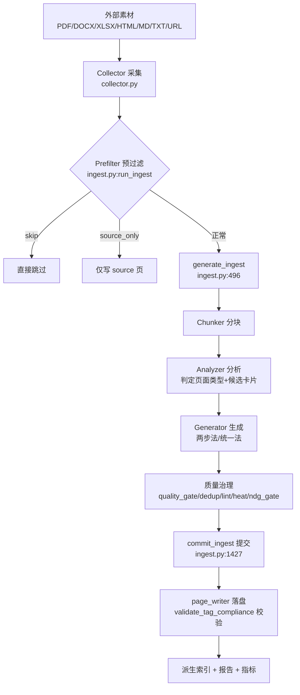

# 摄取流程（Ingest Pipeline）介绍

> 本文档基于 2026-08-03 实测代码梳理，介绍 `ruflo-kb` 项目"摄取流程"的当前实现：它是什么、从哪里触发、分几个阶段、各阶段干什么、支持什么输入，以及已知缺口与演进方向。
> 配套文档：`docs/reference/ingest-prompts.md`（全部 LLM 提示词）、`docs/superpowers/plans/2026-08-02-ingest-pipeline-completion.md`（完善方案）、`docs/CONSTRAINTS.md`（输出格式约束）。

---

## 1. 它是什么

**摄取流程（Ingest Pipeline）** 负责把「外部素材」转化为「结构化知识卡片」。

- **输入**：PDF / Word / Excel / HTML / Markdown / 纯文本 / 网页 URL。
- **输出**：一个或多个 `WikiPage` 知识卡片，以 Markdown 文件作为**真相源**落盘，并派生出检索索引（LanceDB 等）。
- **核心目标**：让 LLM 在采集到的原始内容之上，自动产出带 frontmatter 元数据、正文、标签、wikilink 的结构化页面，写入项目知识库。

一句话：**采集 → 预过滤 → 分析 → 生成 → 质量治理 → 提交落盘**。

---

## 2. 触发入口

摄取不是单一函数直调，而是经「事件总线」统一驱动：

| 入口 | 位置 | 说明 |
|------|------|------|
| CLI | `python -m src.cli ...`（如 `research` 命令，`src/cli_ext/research_cmd.py`） | 用户命令行触发 |
| HTTP API | `src/server/routes/ingest.py` | `/api/v1` 下的 ingest 路由 |
| MCP | `src/mcp_server/api_client.py:ingest` | 智能体/MCP 工具调用 |
| 事件总线 | `PipelineService.run_for_collector_start`（`src/pipeline/service.py:62`） | 上述入口最终都发出 `collector:start` 事件，由它统一接管 |

`PipelineService` 是组合根（composition root），持有 `PipelineRunner`、已注册 stage 列表、队列服务（`src/pipeline/service.py:38`）。

---

## 3. 整体流程

> **重要事实**：`PipelineService._stages` 默认是 `[CollectorStage, AnalyzerStage, GeneratorStage]`（`service.py:51`），但 `_run_for_collector_start_inner` 实际只跑 `self._stages[:1]`（**仅 Collector**，`service.py:107`），随后调用旧的 `run_ingest()` 完成「分析 + 生成 + 提交」。`PipelineRunner.run_stages`（`runner.py:28`）目前**未被该路径调用**——它是为新 KOS stage 预留的编排器。

---

## 4. 各阶段职责

### 阶段 1 · Collector（采集）
- 文件：`src/pipeline/collector.py`
- 按扩展名分派抽取器（`collector.py:286-295`）：
  - `.pdf` → PDF 文本抽取
  - `.docx` / `.doc` / `.xlsx` / `.xls` → Office 抽取
  - `.html` / `.htm` → HTML 抽取
  - `.md` / `.txt` → 直接读
  - **URL** → `httpx` 抓取，带 **SSRF / 私网守卫**（`_check_url_allowlisted`，`collector.py:171`，拒绝解析到私有/回环/链路本地地址）
- 产出：原始文本 `content` + 项目内相对路径 `raw_path`，封装为 `CollectorDonePayload`。

### 阶段 2 · Prefilter（预过滤，D3）
- 在 `run_ingest` 一开始就跑（`ingest.py:1482`），**早于任何 LLM 调用**。
- 依据：文件大小、清洗质量分（sanitizer）、列表密度、语言。
- 决策分支：
  - `skip` → 直接跳过，不写任何页。
  - `source_only` → 只写一张 source 原始页（无 LLM 加工）。
  - `reference_list` → 列表型文档，继续生成但抑制 stub。
  - 正常 → 进入 `generate_ingest`。

### 阶段 3 · generate_ingest（核心创作，`ingest.py:496`）
1. **Chunker 分块**：长文切分为可处理的块。
2. **Analyzer 分析**：用 LLM 判定每块的页面类型并产出候选卡片。存在**两套提示词**：
   - Markdown 路径：`ANALYZER_PROMPT`（4 类：source / entity / concept / synthesis）
   - JSON 路径：`ANALYZER_JSON_PROMPT`（6 类：concept / entity / claim / decision / procedure / event）
   - ⚠️ 这两套与 `src/wiki/core/types.py` 的 **8 类** `PageType` 枚举并不同步（详见 §6 缺口）。
3. **Generator 生成**：把候选扩展为完整 `WikiPage`（frontmatter + body + 标签 + wikilink）。
   - 两步法：`GENERATOR_PROMPT`
   - 统一法：`UNIFIED_PROMPT`
4. **质量治理五件套**：
   - `quality_gate`：质量门槛
   - `dedup`：去重
   - `lint`：结构/lint 检查
   - `heat`：热度/重要性评估
   - `ndg_gate`：NDG 门（含 UGC 强制标签校验）

### 阶段 4 · Commit & Write（提交落盘）
- `commit_ingest`（`ingest.py:1427`）：把生成的 `WikiPage` 列表写出为 Markdown 真相源，并更新派生索引。
- `page_writer.py`：新建页面时调用 `validate_tag_compliance(page.tags)`（`page_writer.py:74`）——校验**值域**（题材/功能/情绪/场景阶段/状态/素材/可信度 7 个受约束前缀）+ **强制配对**（素材/ugc + 可信度/ugc）；越界或缺配对即抛 `TagValidationError` 阻断写入。

### 阶段 5 · 可观测性
- 生成摄取报告（`ingest_report.py: build_report / write_ingest_report`）。
- 上报 Prometheus 指标：摄取时长、判定结果（`success` / `rejected` / `failed` / `needs_human_review`）。
- LLM 不可达（熔断 OPEN / 重试耗尽 / 内容审核拦截）时，回退为 source-only stub 页而非整体失败（C1 重试感知）。

---

## 5. 支持的输入格式

| 类别 | 扩展名 / 来源 |
|------|---------------|
| 文档 | `.pdf`、`.docx`、`.doc`、`.xlsx`、`.xls` |
| 网页 | `.html`、`.htm`、URL（带 SSRF 守卫） |
| 文本 | `.md`、`.txt` |

---

## 6. 已知缺口与演进方向

> 以下基于 2026-08-03 实测代码，与 `docs/superpowers/plans/2026-08-02-ingest-pipeline-completion.md`、`docs/evaluations/wiki-spec-sync-audit.md` 等文档一致。

1. **KOS 新组件未接线**：`src/pipeline/stages/` 下已写好 `ReviewerStage` / `CandidatePromoter` / `ClaimExtractor` / `IndexerStage` 等 KOS 演进组件，但默认 stage 列表仍是旧三件套，且编排路径只跑 Collector + 旧 `run_ingest`。这些组件当前零调用。→ 完善方案见 `2026-08-02-ingest-pipeline-completion.md`。

2. **标签值域强制「覆盖不全」**：写入时仅**新建页面**触发 `validate_tag_compliance`（`page_writer.py:74` 在 `if not path.exists()` 时才校验），**更新既有页面跳过**；Generator 内部 `_resolve_page_tags()` 只按前缀静默过滤、不做值域校验；自由前缀（角色/事件/实体）仍接受任意值；同义写法（现言 vs 现代言情）无归一化。

3. **页面类型清单三套矛盾**：`types.py` 8 类、Analyzer markdown 4 类、Analyzer JSON 6 类，而 `generator._DEPTH_BY_TYPE` 仅 4 类映射——一旦 LLM 产出新类型即 `KeyError` 崩溃。需先做架构裁决（类型归属），再统一为单一来源。→ 见 `docs/superpowers/plans/2026-08-03-wiki-spec-sync.md` 的决策门 G0/G1/G2。

---

## 7. 关键文件索引

| 文件 | 职责 | 关键位置 |
|------|------|----------|
| `src/pipeline/service.py` | 组合根，事件入口，stage 编排 | `run_for_collector_start:62`；`_stages:51`；仅跑 Collector `:107` |
| `src/pipeline/runner.py` | `PipelineRunner.run_stages`（预留给新 KOS stage） | `run_stages:28` |
| `src/pipeline/ingest.py` | `run_ingest`（预过滤+生成+提交）、`generate_ingest`、`commit_ingest` | `run_ingest:1482`；`generate_ingest:496`；`commit_ingest:1427` |
| `src/pipeline/collector.py` | 采集与格式分派、URL SSRF 守卫 | 格式分派 `:286`；`_check_url_allowlisted:171` |
| `src/pipeline/analyzer.py` | Analyzer 双提示词（4 类 / 6 类） | `ANALYZER_PROMPT` / `ANALYZER_JSON_PROMPT` |
| `src/pipeline/generator.py` | Generator 两步法 / 统一法、slot 契约 | `GENERATOR_PROMPT` / `UNIFIED_PROMPT` / `_DEPTH_BY_TYPE` |
| `src/wiki/storage/page_writer.py` | 页面落盘 + 标签合规校验 | `validate_tag_compliance` 调用 `:74` |
| `src/pipeline/stages/` | KOS 演进组件（未默认接线） | `reviewer` / `candidate_promoter` / `claim_extractor` / `indexer` |
| `src/server/routes/ingest.py` | HTTP API 入口 | ingest / ingest_status / ingest_tasks |

---

## 8. 相关文档

- `docs/reference/ingest-prompts.md` — 全部摄取 LLM 提示词原文与位置
- `docs/superpowers/plans/2026-08-02-ingest-pipeline-completion.md` — 摄取流程完善方案（接线 KOS 组件、补值域覆盖）
- `docs/evaluations/wiki-spec-sync-audit.md` — 独立审计（指出类型清单矛盾等致命问题）
- `docs/CONSTRAINTS.md` — Wiki 页面输出格式约束（frontmatter / 标签 / 值域）
- `docs/guides/wiki-spec.md` — 页面规范（ID / Frontmatter / Body / 模板）
</content>
</invoke>
