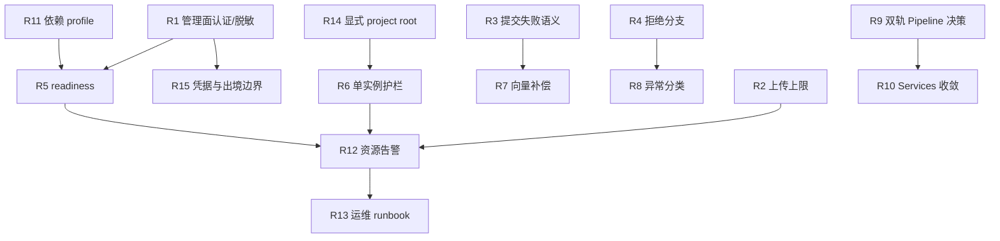

# ruflo-kb 架构整改方案

> 来源：[系统架构审计](../../ARCHITECTURE_AUDIT.md)
>
> 方案类型：As-Is 风险整改，不扩展业务范围
>
> 目标部署形态：受控单机、单进程、单 worker、本机文件系统

## 1. 整改原则

1. 先关闭信任边界和数据损坏风险，再做可观测与演化收敛。
2. 每个风险只指定一个主根因；次要关联根因仅用于说明，不复制整改入口。
3. 优先复用现有 `safe_write`、`QueueService`、`ProviderRegistry`、Services 和 WikiPaths，不新增基础设施。
4. 不把“以后可能多实例”当作本轮需求；本轮将单进程约束编码为启动护栏。
5. 每项整改必须有可执行验收条件；文档、测试和运行时行为三者不一致时，以运行时行为为准。

## 2. 风险总表

| 编号 | 风险等级 | 风险主题 | 主根因 | 整改优先级 | 代价 |
|---|---|---|---|---|---|
| R1 | 致命 | HTTP 管理面无认证且泄露 API Key | A 隐性假设缺失 | P0 | 中 |
| R2 | 重大 | 上传无大小上限、一次性读入内存 | E 资源模型不合理 | P0 | 低 |
| R3 | 重大 | `AtomicContext` 部分提交且吞错 | C 数据流/状态缺陷 | P1 | 中 |
| R4 | 重大 | 低质量文档拒绝分支确定性失败 | B 模块边界/接口错误 | P1 | 低 |
| R5 | 重大 | `/health` 假绿，无法区分 readiness | G 可观测/运维缺失 | P1 | 中 |
| R6 | 重大 | 多 worker/多实例会覆盖 Queue 状态 | A 隐性假设缺失 | P1 | 低 |
| R7 | 重大 | Wiki 已写、向量未写缺少补偿闭环 | C 数据流/状态缺陷 | P1 | 中 |
| R8 | 重大 | 异常被宽泛吞掉，故障无法隔离 | D 故障模型缺失 | P1 | 中 |
| R9 | 次要 | 候选知识链路与默认 Pipeline 双轨 | F 扩展性设计缺陷 | P2 | 中 |
| R10 | 次要 | HTTP routes 绕过 Services，领域双向耦合 | B 模块边界/职责错误 | P2 | 中 |
| R11 | 次要 | 依赖不可复现，声明的 embedding fallback 不稳定 | A 隐性假设缺失 | P2 | 低 |
| R12 | 次要 | 缺少关联 ID、告警和结构化故障指标 | G 可观测/运维缺失 | P2 | 中 |
| R13 | 次要 | 版本、启动、备份与回滚没有统一运维契约 | G 可观测/运维缺失 | P2 | 中 |
| R14 | 重大 | CWD/项目隔离依赖隐式约定 | A 隐性假设缺失 | P1 | 中 |
| R15 | 重大 | Provider 明文存储、日志/出境边界不清 | A 隐性假设缺失 | P0 | 中 |

代价含义：低＝局部代码和测试，不改公开数据格式；中＝跨 Module Interface 或运行配置调整，可能增加迁移/回归；高＝需要改变存储或部署形态。本方案没有“高”代价项，因为本轮不迁移外部 Queue、数据库或微服务。

## 3. 逐项整改方案

### R1 — 致命：HTTP 管理面无认证且泄露 API Key

**风险简述**：服务默认是 localhost，但 `--host` 可绑定任意地址；Provider 详情和新增响应使用 `redact_keys=False`，项目、摄取、删除、队列控制也没有用户身份边界。

**触发场景**：运维人员使用 `--host 0.0.0.0`；容器把端口映射到局域网；反向代理暴露服务；同机恶意网页向管理端发起请求。

**影响范围**：所有已配置 LLM Provider 的凭据、所有注册项目、原始文件、Wiki 删除/写入、摄取资源和队列状态。

**根因分类**：A 类（设计默认 localhost 永久可信）。次要关联为 G 类（缺少暴露告警）。

**可选整改方案**：

- **方案 A（推荐）**：Provider 所有 API 响应强制脱敏；无 Token 时禁止非回环绑定；配置一个单一 Bearer Token，保护所有 `/api/v1` 写操作、Provider 管理和破坏性操作；`/health` 保持匿名。
- 方案 B：仅允许反向代理承担认证，应用继续无认证。实现较少，但误配置时风险无法由应用自我阻断。
- 方案 C：引入用户/角色/OAuth。安全能力最完整，但超出单机产品当前需求。

**整改代价**：中。开发改动量中等；需增加启动配置和 HTTP middleware，写操作返回 401/403；不改 Wiki/Queue 存储。

**验收**：

- `GET /api/v1/providers/{name}`、`POST /api/v1/providers` 永不出现原始 key。
- 无 Token 时以非回环 host 启动失败；有 Token 时未授权请求全部为 401。
- 授权后原有 CLI/WebUI 主路径仍可运行；health 可匿名访问且不泄露配置。

### R2 — 重大：上传无大小上限、一次性读入内存

**风险简述**：路由调用 `await file.read()` 后才进入 Services，服务层只有扩展名检查，没有最大字节数或流式写入。

**触发场景**：上传超大 PDF、并发提交多个大文件、未认证接口被恶意请求轰炸。

**影响范围**：API 进程内存、系统稳定性、同进程 Queue 和其他项目请求。

**根因分类**：E 类（资源模型没有明确上限）。

**可选整改方案**：

- **方案 A（推荐）**：配置单文件上限（例如 50 MiB，值放在现有 Settings）；分块读取，累计超过上限立即返回 413；写入临时文件后原子替换。
- 方案 B：只增加 FastAPI/反向代理 body limit。代码路径仍一次性读内存，不适合作为唯一控制。

**整改代价**：低。局部修改 route/Service 和一个测试；不改存储格式。

**验收**：小文件成功；超过上限返回 413 且目标文件不存在；并发大文件不会形成无界内存增长。

### R3 — 重大：`AtomicContext` 部分提交且吞错

**风险简述**：单文件 `tmp + replace` 可防撕裂，但 `AtomicContext` 逐路径 flush，单路径失败和 callback 异常被记录后吞掉，调用方仍可能认为提交成功。

**触发场景**：磁盘满、权限改变、杀毒软件锁定单个文件、Windows replace fallback 触发；页面写入成功但 index/log 失败。

**影响范围**：Wiki 页面、`index.md`、`log.md`、删除操作、Queue 任务状态和后续检索索引。

**根因分类**：C 类（提交状态没有清晰的成功/失败模型）。次要关联为 D 类。

**可选整改方案**：

- **方案 A（推荐，单机最小改动）**：将 `AtomicContext` 语义改为“批量延迟写”；flush 任一失败即抛出聚合异常，任务标记 FAILED，并保留失败路径清单供重试。
- 方案 B：staging 目录写齐所有文件后交换提交清单，实现真正批量提交；需要定义恢复扫描。
- 方案 C：引入数据库事务。当前不建议，增加存储和运维复杂度。

**整改代价**：中。需调整异常 Interface、任务状态和测试；不改主数据存储，但需增加失败清单/重试状态。

**验收**：人为让第二个文件写失败时，调用方收到异常、Queue 任务为 FAILED、日志包含失败路径；不能返回成功；已有单文件 crash-safe 行为保持不变。

### R4 — 重大：低质量文档拒绝分支确定性失败

**风险简述**：`_write_rejected_source_page` 使用 `async with AtomicContext()`，但上下文只实现同步协议；同时给 `write_page`、`append_to_index`、`log_event` 传入不存在的 `ctx` 参数。

**触发场景**：设置 `RUFLO_SANITIZER_SKIP_LLM=1`，且预过滤判定源文本质量不足。

**影响范围**：本应生成 grade=C 来源页的摄取任务；可能造成任务失败、无审计页和错误重试。

**根因分类**：B 类（调用方与 Module Interface 契约不一致）。

**可选整改方案**：

- **方案 A（推荐）**：改成现有同步 `with AtomicContext(flush_pending_writes)`，按真实函数签名调用；补一条端到端分支测试。
- 方案 B：给 `AtomicContext` 增加异步协议和写入函数兼容参数。会扩大 API 表面，掩盖现有调用错误，不推荐。

**整改代价**：低。局部修复和回归测试；不改数据存储和外部 Interface。

**验收**：该环境变量分支成功返回 C 级 WikiPage，页面、index、log 均生成；默认分支行为不变。

### R5 — 重大：`/health` 假绿

**风险简述**：`/health` 无条件返回 `ok: true`；Provider、embedding、向量库和 Queue 恢复失败通常只打 warning。

**触发场景**：Provider 无法访问、sentence-transformers 未安装、LanceDB 初始化失败、Queue 文件损坏或 Wiki 目录不可写。

**影响范围**：部署探针、自动重启、人工值班判断、摄取和检索可用性。

**根因分类**：G 类（liveness/readiness 未分离）。

**可选整改方案**：

- **方案 A（推荐）**：保留 `/health` 为 liveness；新增 `/ready`，分项检查 Queue 文件可读写、Wiki 根目录可写、向量句柄初始化、默认 Provider 配置/健康状态；返回 200/503。
- 方案 B：直接让 `/health` 变成深度检查。兼容性差，容易让进程存活探针因外部 LLM 波动反复重启。

**整改代价**：中。需增加检查器和路由，可能调整部署配置；不改存储。

**验收**：逐项模拟故障时 `/health` 仍表示进程存活，`/ready` 指出具体失败项并返回 503；恢复后自动回 200。

### R6 — 重大：多 worker/多实例覆盖 Queue 状态

**风险简述**：Queue 使用进程内锁和单 JSON 快照；EventBus、in-flight、semaphore、metrics 也为进程内状态，没有跨进程锁或启动护栏。

**触发场景**：Uvicorn 配置 `--workers > 1`、重复启动两个服务、多个容器挂载同一项目目录。

**影响范围**：任务丢失、重复摄取、状态覆盖、死信错误和指标分裂。

**根因分类**：A 类（单进程假设未编码）。次要关联为 C 类。

**可选整改方案**：

- **方案 A（推荐）**：启动时拒绝多 worker；以项目根目录锁/PID 文件拒绝第二实例；文档明确共享目录不可由多实例写入。
- 方案 B：Queue 文件增加跨进程锁。仍不能解决 EventBus、in-flight 和 MetricsRegistry，边界不完整。
- 方案 C：迁移共享 Queue、事件和指标到外部服务。仅在明确多实例需求后实施。

**整改代价**：低（方案 A）。增加启动检查和运维提示，不改数据存储。

**验收**：第二实例和 `--workers 2` 明确失败；单实例重启仍能恢复 PENDING；同一目录不会产生两个持有者。

### R7 — 重大：Wiki 已写、向量未写缺少补偿闭环

**风险简述**：Wiki 是事实源、LanceDB 是派生状态，但页面提交成功后向量 upsert 失败时，没有统一的可发现、可重试状态。

**触发场景**：embedding Provider 超时、向量库不可写、维度不匹配、进程在页面写入后崩溃。

**影响范围**：页面存在但语义搜索缺页；用户难以判断是数据不存在还是索引过期。

**根因分类**：C 类（事实源与派生状态之间没有显式同步状态）。

**可选整改方案**：

- **方案 A（推荐）**：在现有 `.index` 增加待索引记录；Wiki commit 成功后写入 pending，upsert 成功删除；启动/CLI health 扫描并重试。
- 方案 B：每次搜索发现缺页后同步补建。用户请求路径变慢，失败会反复触发。
- 方案 C：把向量写入变成 Wiki commit 的硬依赖。可用性下降，不符合“向量可重建”定位。

**整改代价**：中。增加派生状态和补偿任务，不改变 Wiki 页面格式；需增加重试接口。

**验收**：模拟 upsert 失败后，页面可读、pending 可见；恢复 Provider 后自动或手工重试，向量补齐且不会重复写坏页面。

### R8 — 重大：异常被宽泛吞掉，故障无法隔离

**风险简述**：大量 `except Exception` 将配置错误、数据错误、依赖故障和程序 bug 混为 warning；EventBus 后台任务也缺少统一完成回调。

**触发场景**：Provider 返回异常格式、磁盘权限改变、代码回归抛出未预期异常、后台 task 未被 await。

**影响范围**：任务可能成功返回空页/stub，系统故障传播到后续阶段，定位依赖人工翻日志。

**根因分类**：D 类（故障模型没有按可恢复/不可恢复分层）。

**可选整改方案**：

- **方案 A（推荐）**：定义最小异常分类：`RetryableDependencyError`、`InvalidInputError`、`DataConsistencyError`、`ProgrammingError`；Queue 只重试前者，后两类立即失败并保留上下文。
- 方案 B：先只增加统一日志字段和 `raise` 白名单，不改异常类型。改动低但隔离不完整。

**整改代价**：中。需调整若干异常边界和测试；不改存储。

**验收**：网络超时进入 retry；输入/Schema 错误不重试；数据一致性错误进入 FAILED 并告警；未预期异常不被静默转换为成功。

### R9 — 次要：候选知识链路与默认 Pipeline 双轨

**风险简述**：Reviewer、Promoter、KnowledgeObject Generator 已实现，但默认仍走 `generate_ingest` / `commit_ingest`；两套模型持续增加维护成本。

**触发场景**：新开发者按 Stage/KnowledgeObject 设计新增功能，却发现生产入口仍是 legacy flow；两条链路的质量策略出现差异。

**影响范围**：Pipeline 演化、质量策略、测试覆盖和文档理解成本。

**根因分类**：F 类（预留扩展没有形成单一演化轴）。

**可选整改方案**：

- **方案 A（推荐）**：冻结候选链路新增功能，建立迁移 spike；若两周内无明确业务价值，删除未接入代码和文档入口。
- 方案 B：把 Reviewer → Promoter 逐步接入默认 Pipeline，保留 legacy 兼容开关和 shadow 对比。
- 方案 C：继续双轨并行。仅适合已有两类明确用户，不建议作为默认状态。

**整改代价**：中。方案 A 主要是删除/文档；方案 B 需要调整 Pipeline Interface、数据状态和回归测试。

**验收**：仓库中明确唯一默认摄取入口；另一条链路要么有集成测试和切换开关，要么被移除。

### R10 — 次要：HTTP routes 绕过 Services，领域双向耦合

**风险简述**：部分 route 和 lifespan 直接调用 Wiki、Knowledge、Pipeline 内部函数；`server → wiki` 和 `wiki ↔ knowledge` 形成高耦合。

**触发场景**：替换存储布局、增加第二种 API 入口、修改生命周期模型或 Wiki schema。

**影响范围**：改动传播面、测试隔离、未来存储替换成本。

**根因分类**：B 类（Module Interface 没有成为唯一入口）。

**可选整改方案**：

- **方案 A（推荐）**：只在修改相关 route 时，将其调用收敛到现有 Services；Services 对外提供稳定方法，内部 Wiki 调用留在 Service 内。
- 方案 B：一次性重构所有 route。边界更干净，但回归面大，违反最小改动原则。

**整改代价**：中。涉及 Interface 调整，不改存储；按模块增量进行。

**验收**：新增 route 不直接导入 Wiki storage 内部；至少关键写操作统一经过 Service；现有 API contract 测试保持通过。

### R11 — 次要：依赖不可复现、embedding fallback 不稳定

**风险简述**：依赖只有下限，无锁文件；本地 embedding fallback 的包未列入运行依赖，启动时可能降级到关键词。

**触发场景**：新环境安装到不兼容的最新版本；远程 Provider 不可用且本地模型未安装。

**影响范围**：部署可重复性、检索质量、启动 readiness。

**根因分类**：A 类（默认环境条件未被声明和验证）。

**可选整改方案**：

- **方案 A（推荐）**：生成锁定依赖文件；明确本地 embedding 为可选 profile，未安装时 readiness 明确显示 keyword-only；为每种部署 profile 做 smoke。
- 方案 B：把 sentence-transformers 加入默认依赖。安装体积和部署时间增加，不适合所有本机环境。

**整改代价**：低。主要是依赖和文档；不改 Wiki/向量格式。

**验收**：同一锁文件可重复安装；无本地模型时系统不假装有语义检索；Provider fallback 状态可见。

### R12 — 次要：缺少关联 ID、告警和结构化故障指标

**风险简述**：已有基础 metrics 和日志，但没有 HTTP → Queue → Pipeline → Provider → Writer 的统一关联，也没有告警规则。

**触发场景**：队列积压、Provider 连续失败、磁盘写失败、单项目长期向量缺失。

**影响范围**：故障定位时间、恢复时间和值班止损。

**根因分类**：G 类（可观测契约缺失）。

**可选整改方案**：

- **方案 A（推荐）**：统一 `request_id`、`task_id`、`project_id` 字段；新增 dead-letter、queue backlog、provider failure、write failure 四项指标和告警阈值。
- 方案 B：引入 OpenTelemetry。能力更强，但当前单进程部署不需要先承担平台成本。

**整改代价**：中。跨日志调用链加字段；不改数据存储。

**验收**：给定 task ID 可定位到来源、Provider、页面和失败原因；四类故障可由指标触发告警。

### R13 — 次要：版本、启动、备份与回滚没有统一运维契约

**风险简述**：包版本 `2.0.0` 与 API/health `0.2.0` 漂移；启动脚本可误杀端口进程；备份、升级、smoke、向量重建没有统一 runbook。

**触发场景**：升级失败、回滚后版本判断错误、端口被其他服务占用、Wiki 与 `.index` 状态不一致。

**影响范围**：发布止损、恢复时间、诊断准确性。

**根因分类**：G 类（运维状态没有单一事实源）。

**可选整改方案**：

- **方案 A（推荐）**：从一个版本常量生成包/API/health 版本；启动脚本只停止带有本项目 PID 标记的进程；补一页备份→升级→smoke→回滚→向量重建 runbook。
- 方案 B：引入容器和编排平台。超出当前单机目标。

**整改代价**：中。涉及启动脚本、版本导出和运维文档；不改业务存储。

**验收**：三个版本显示一致；回滚演练可恢复 Wiki、Queue、项目元数据并重建向量；不会杀死无关端口进程。

### R14 — 重大：CWD/项目隔离依赖隐式约定

**风险简述**：Queue、WikiPaths、缓存和部分 CLI 路径会依赖 CWD；多项目虽有 `WikiPaths`，但 lifespan 和旧入口仍存在自动推断。

**触发场景**：从错误目录启动、服务管理器工作目录改变、多个项目共用一个进程、用户误把项目相对路径当绝对路径。

**影响范围**：写入错误项目、搜索错误索引、Queue 串项目、跨项目数据暴露。

**根因分类**：A 类（工作目录被假设为项目身份）。次要关联为 C 类。

**可选整改方案**：

- **方案 A（推荐）**：服务启动必须显式指定 project root；所有写入路径由 `resolve_project` 返回的 `WikiPaths` 派生；发现不到唯一项目时拒绝启动，不静默猜测 CWD。
- 方案 B：保留自动发现但只读；任何写操作前强制带 project ID。

**整改代价**：中。需调整启动配置和部分 CLI/Service Interface；不改变 Wiki 格式。

**验收**：改变 CWD 不会改变目标项目；无明确 project ID 的写操作失败；多项目测试不会交叉写入。

### R15 — 重大：Provider 明文存储、日志/出境边界不清

**风险简述**：Provider 配置 JSON 保存 API Key；Windows 权限保护弱于 POSIX；外部 LLM 发送内容、日志脱敏和凭据轮换未形成契约。

**触发场景**：备份目录泄露、同机其他用户读取配置、日志记录请求内容、向第三方 Provider 发送敏感原文。

**影响范围**：API Key、原始文档、生成内容、合规与凭据轮换。

**根因分类**：A 类（凭据和数据处理边界被假定为本机可信）。

**可选整改方案**：

- **方案 A（推荐）**：短期不改 Provider 数据格式，但严格限制文件路径、启动时检查权限、日志禁止原文和 key；增加 key 轮换/删除命令和外部 Provider 数据发送提示。
- 方案 B：使用 Windows Credential Manager / OS keyring 存 API Key，配置文件只存引用。安全性更强，但跨平台实现和迁移成本更高。
- 方案 C：引入集中密钥服务。与当前单机形态不匹配。

**整改代价**：中。方案 A 需要配置检查、脱敏和命令；方案 B 需 ProviderRegistry 存储迁移；不改 Wiki 数据。

**验收**：备份、日志、metrics、HTTP 响应均无 key/原文；可轮换和删除 key；Provider 类型明确标示数据是否出站。

## 4. 依赖关系与实施顺序

### Wave 0：外部暴露止损（P0）

顺序：R1 → R2 → R15。

目标：在任何非回环部署前消除凭据泄露、未授权管理和无界上传。此阶段不碰 Pipeline 和 Wiki 数据。

### Wave 1：数据正确性与可用性（P1）

顺序：R4 → R3 → R6/R14 → R5 → R7 → R8。

目标：使失败可见、任务状态可信、项目不会串写，并让向量派生状态可补偿。

### Wave 2：演化与运维（P2）

顺序：R9 → R10 → R11 → R12 → R13。

目标：收敛唯一主链路，降低未来改动面，并具备最小可定位、可回滚能力。

## 5. 统一验收清单

### 致命/重大风险验收

- 非回环 host 无 Token 启动失败；任何 Provider API 响应和日志均不含原始 key。
- 超过上传上限返回 413，不产生目标文件，不造成无界内存读取。
- `RUFLO_SANITIZER_SKIP_LLM=1` 的低质量输入生成 C 级来源页。
- 任一批量写失败会让任务失败且携带失败路径，不返回假成功。
- 第二实例、多 worker 和错误 CWD 均被拒绝或明确要求 project root。
- `/health` 只表示 liveness，`/ready` 可定位 Wiki、Queue、向量库和 Provider 的具体状态。
- Wiki 成功、向量失败时存在 pending 补偿记录，恢复后可重试且幂等。

### 次要风险验收

- 默认摄取链路唯一；候选链路有集成开关或被删除。
- 新写操作不绕过 Services；依赖安装可复现，fallback 状态可见。
- task 可通过 `request_id/task_id/project_id` 定位；dead-letter、积压、Provider 失败和写失败有告警。
- 版本统一，备份/升级/smoke/回滚/向量重建 runbook 至少演练一次。

## 6. plan-audit 第一轮：全面漏洞审查

以下审查针对本方案本身，不是重复审计现有代码。

| 问题级别 | 方案漏洞 | 后果 | 加固方案 |
|---|---|---|---|
| 致命 | R1 只写 Bearer Token，未定义 Token 从哪里生成、如何存放、如何轮换 | 认证实现可能把 Token 写入仓库或日志，形成新的凭据泄露 | 使用现有用户配置目录，通过 CLI 生成；启动拒绝空 Token；日志永不打印 Token；提供轮换后旧 Token 立即失效 |
| 致命 | R3 “提交失败抛出”没有定义已写文件如何恢复 | 失败后仍可能留下部分页面和 index | 记录失败路径；任务标记 FAILED；提供现有 Wiki 扫描/重建命令；不宣称回滚未实现的文件 |
| 重大 | R5 readiness 检查 Provider 可能把外部网络短暂波动当成不可用 | 服务频繁摘除或重启，形成雪崩 | readiness 默认只检查配置和最近一次健康状态；外部探测设置短超时、缓存和降级状态，不让 liveness 依赖网络 |
| 重大 | R6 PID/锁文件在异常崩溃后可能残留 | 服务无法重启 | 使用带 PID/进程存活校验的锁；旧锁只有确认进程不存在才清理 |
| 重大 | R7 pending 记录本身可能和 Wiki 写入不一致 | 既没有向量，也没有补偿记录 | 将 pending 作为同一批量写入尝试的一部分，但不宣称事务；启动扫描 Wiki 与向量差异作为最终兜底 |
| 重大 | R2 只限制上传 API，URL/CLI/文件夹摄取仍可能无上限 | 另一入口绕过资源控制 | 把限制放在 Collector/统一 source 读取层，并在 HTTP route 额外拒绝超限请求 |
| 重大 | R8 新异常分类可能导致旧异常未被归类 | 任务行为改变，重试策略回归 | 先建立映射表和兼容默认：未知异常 fail-closed，不自动重试；逐项增加测试 |
| 重大 | R15 “不记录原文”可能影响现有诊断 | 故障定位信息不足 | 记录长度、hash、source id 和脱敏摘要，不记录原文和凭据 |
| 优化 | R9 以“两周”决定删除候选链路，但没有负责人和证据门 | 双轨可能长期不收敛 | 在仓库记录采用/放弃决定、调用次数和删除清单，由一次评审确认 |
| 优化 | R10 增量收敛可能长期留下直接 import | 边界改善没有完成定义 | 为新增/修改 route 加静态检查；按模块列迁移清单，不做全仓库大重构 |

第一轮结论：方案可落地，但必须在 Wave 0 明确 Token 生命周期、在 Wave 1 明确部分提交后的恢复语义，并把上传限制下沉到统一 Collector 读取层。以上三点已吸收到实施顺序和验收条件中。

## 7. plan-audit 第二轮：压力测试推演

| 压力场景 | 连锁反应 | 现有方案是否覆盖 | 加固动作 |
|---|---|---|---|
| Provider 突然全部超时 | Queue 重试 → 并发堆积 → dead-letter 增加 → health 假绿 | 部分覆盖 | R5 readiness 缓存状态；R8 仅对可重试异常重试；R12 告警积压和 Provider 失败 |
| 磁盘写满 | 页面/index/log/pending 任一写失败，可能出现部分提交 | 未完全覆盖 | R3 聚合失败并标记 FAILED；R7 扫描补偿；R13 runbook 释放空间后重试 |
| 两个实例同时启动 | 两边都加载 JSON Queue，互相覆盖任务 | 覆盖 | R6 PID/锁文件启动拒绝；不把文件锁作为唯一修复 |
| 恶意上传 10 GiB 文件 | 进程内存耗尽，其他任务被拖垮 | 覆盖 | R2 统一读取层分块上限；R12 资源告警 |
| Token 泄露 | 攻击者调用删除/摄取/Provider 管理 | 覆盖不完整 | R1 轮换旧 Token 立即失效；R15 日志和配置脱敏；必要时停服止损 |
| 服务从错误 CWD 启动 | Queue、Wiki、向量库指向另一项目 | 覆盖 | R14 无显式 project root 拒绝写入；R5 ready 报项目身份 |
| 低质量源文本集中涌入 | sanitizer skip 分支错误，任务全部失败或重试 | 覆盖 | R4 回归测试；R8 将确定性输入错误标记不可重试 |
| 进程在 Wiki commit 后立即崩溃 | Wiki 存在、向量和 pending 可能缺失 | 部分覆盖 | R7 启动扫描事实源与向量差异；补建 pending |
| sentence-transformers 未安装且远程 Provider 不可用 | 语义检索降级为关键词，服务仍显示正常 | 覆盖 | R5 readiness 分项报告；R11 profile 明确降级，不假装语义可用 |
| 维护人员缺席 | 任务死信、磁盘满、版本漂移无人处理 | 未覆盖 | R12 告警；R13 单页 runbook；每项 P0/P1 有明确命令和止损动作 |

第二轮结论：主要临界点是磁盘满、Provider 全部超时、错误 CWD 和多实例启动。方案通过失败可观察、单实例护栏、统一 source 上限和向量补偿降低雪崩风险；不承诺在本轮实现跨文件事务或分布式高可用。

## 8. 最终实施边界

本方案进入编码前必须先确认：

- 是否接受“受控单机、单 worker”作为当前正式支持范围。
- Token 是否只保护本机/局域网管理面，还是需要多用户角色权限。
- 单文件上传上限和磁盘保留策略的业务值。
- 候选知识链路保留接入还是删除。

若没有新的业务约束，默认采用每项标为“推荐”的方案，按 Wave 0 → Wave 1 → Wave 2 执行。任何需要新增外部服务、改变 Wiki 数据格式或允许多实例的需求，都应另立架构决策，不在本整改方案内隐式扩大范围。
